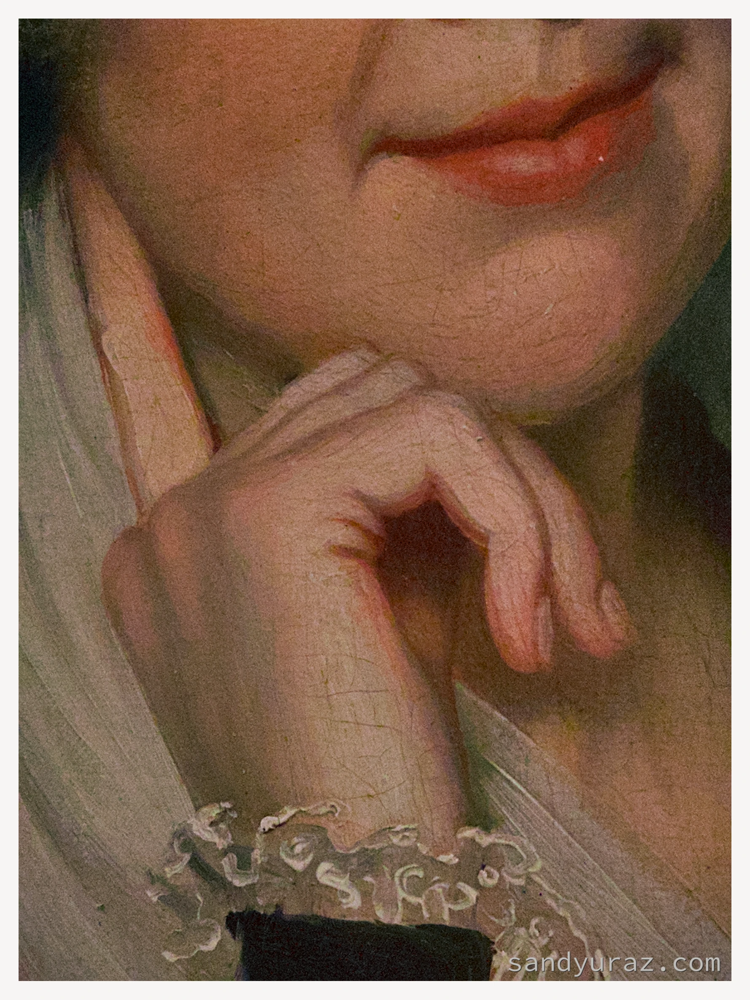
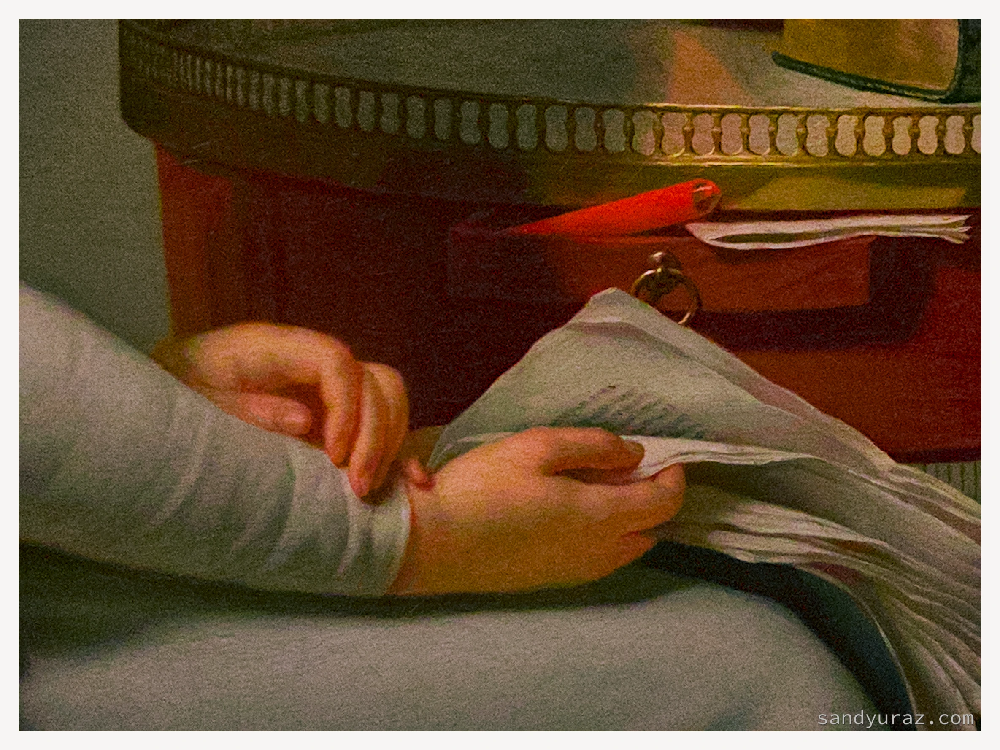
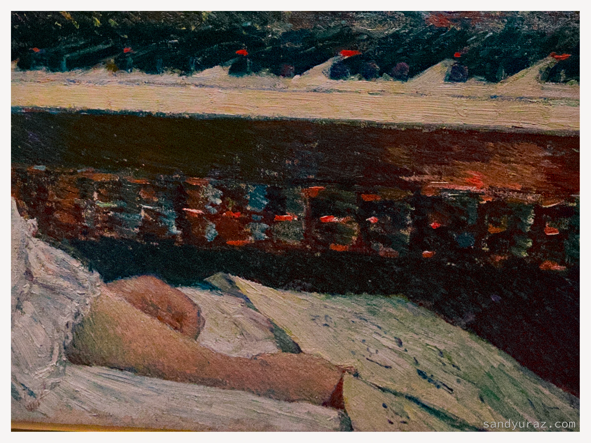
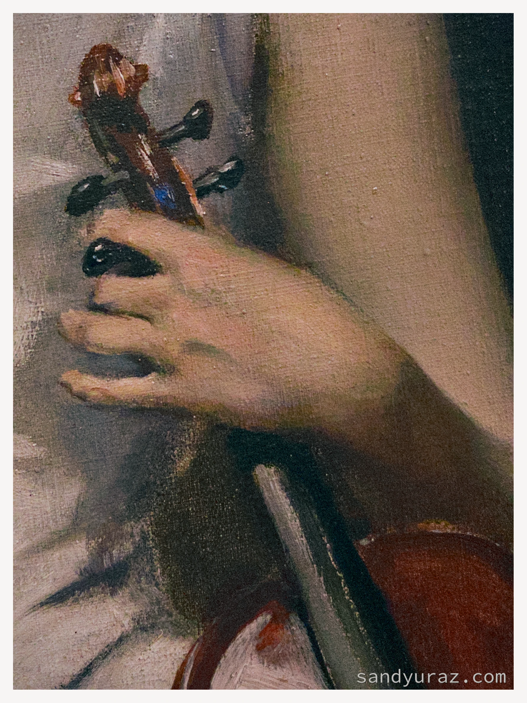
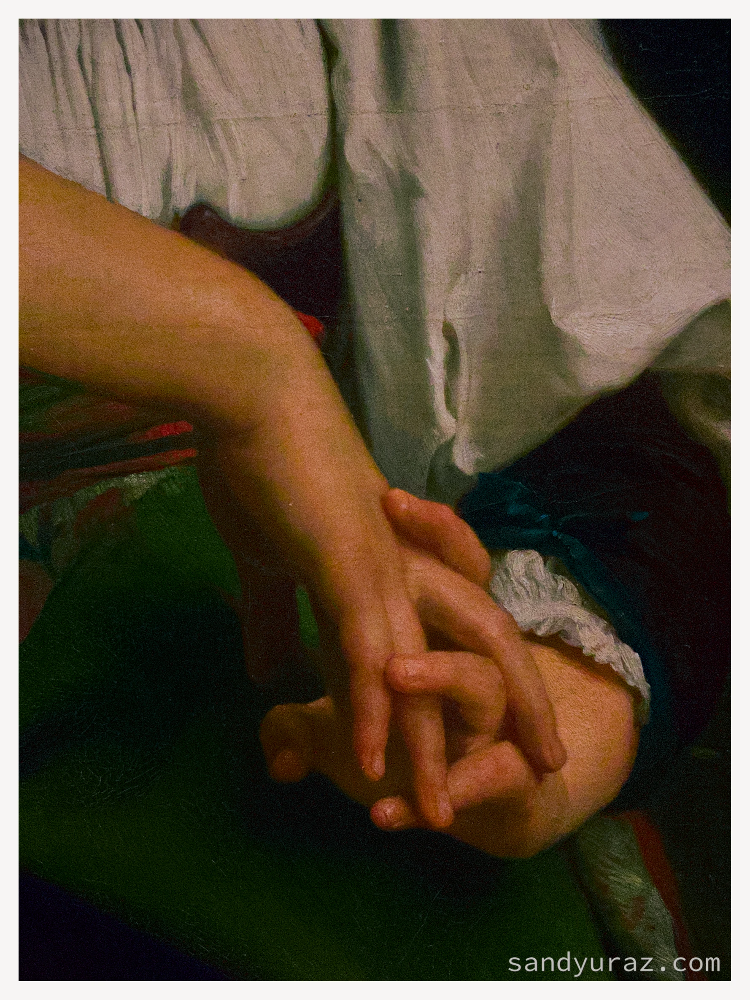
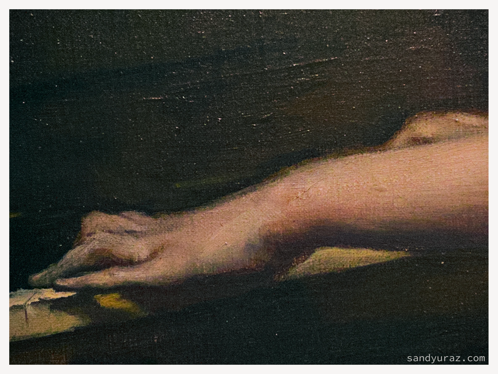
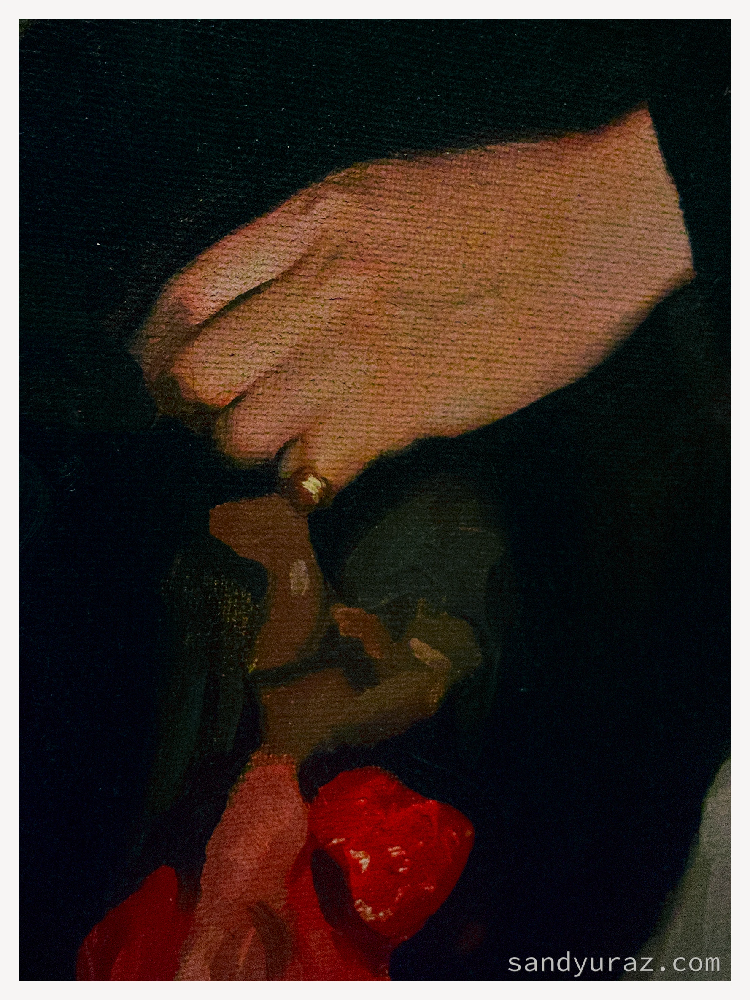
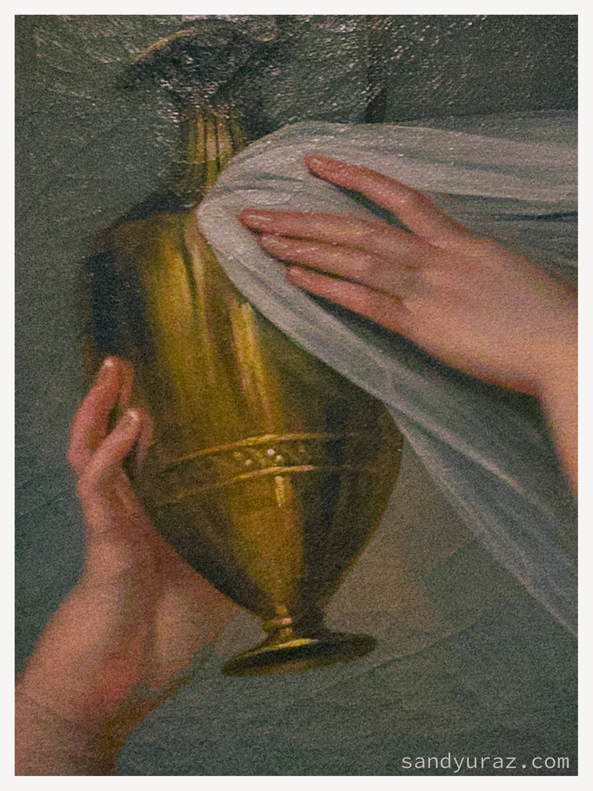
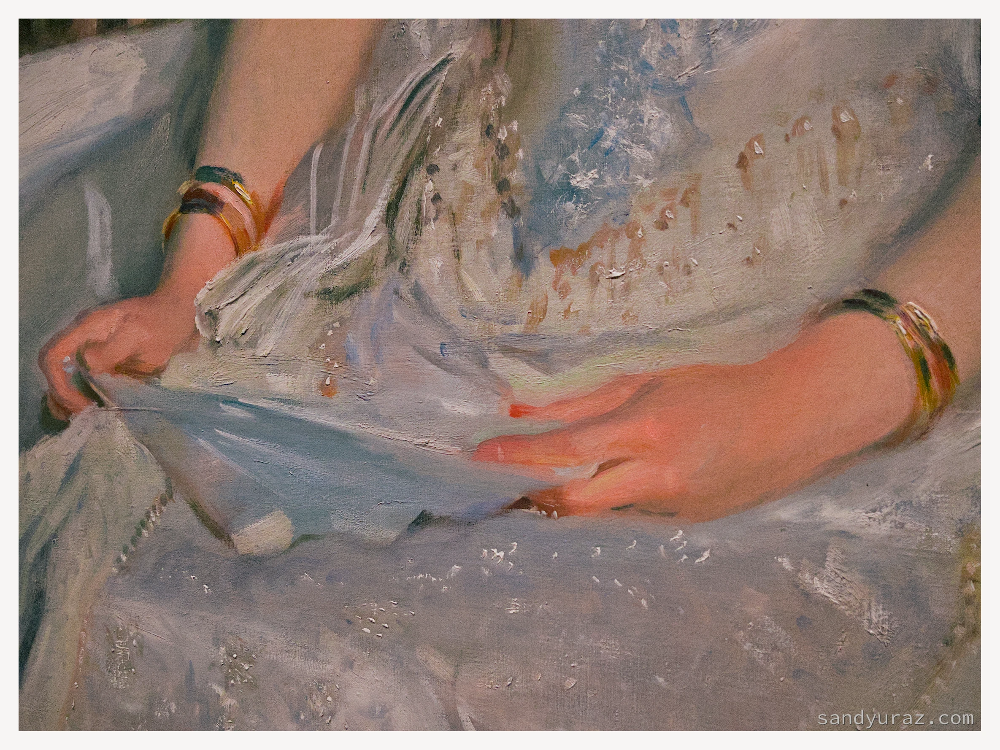

{{{soot_darker}}}
#+date: 122; 12026 H.E. 1933
#+options: preview-generate:nil preview-width:750 preview-height:1000
* ``/Her Painted Hands/''

My /dear reader/, and one day, I hope, to call each other /friends/---welcome to the
little corner I call my home. It's not much; it's not grandiose; it may not even
be comfortable for some.

#+begin_gallery
-  :no-zoom :flex 40
-  :no-zoom :flex 50
#+end_gallery

And I try, I do try, to make it home for all, but how can I if there is a
universe sitting between fellow men. Inasmuch you are still here, let me
share with you one of my first collections of what I find fascinating.

#+begin_gallery
-  :no-zoom :flex 50
-  :no-zoom :flex 45
#+end_gallery

Whether be the great works of art or the lesser known or the ones known at most
to their authors---the human touch and gentleness they radiate intoxicate me.

#+begin_gallery
-  :no-zoom :flex 45
-  :no-zoom :flex 50
#+end_gallery

A hand, a lip, the veins running down their arms, or be strand  of hair
seemingly out of place, but in the most attractive way; all the imperfections
that make us perfect---that is what I want to discover.

#+begin_gallery
-  :no-zoom :flex 50
-  :no-zoom :flex 45
#+end_gallery

Please join me on small adventures of what I want to share, selfishly, for
myself, but if it brings joy to you, and that is more than I can ask, so I'm
grateful.

#+begin_gallery
-  :no-zoom :flex 35
-  :no-zoom :flex 60
#+end_gallery

One day, I hope to see you here again. /My dear stranger./
