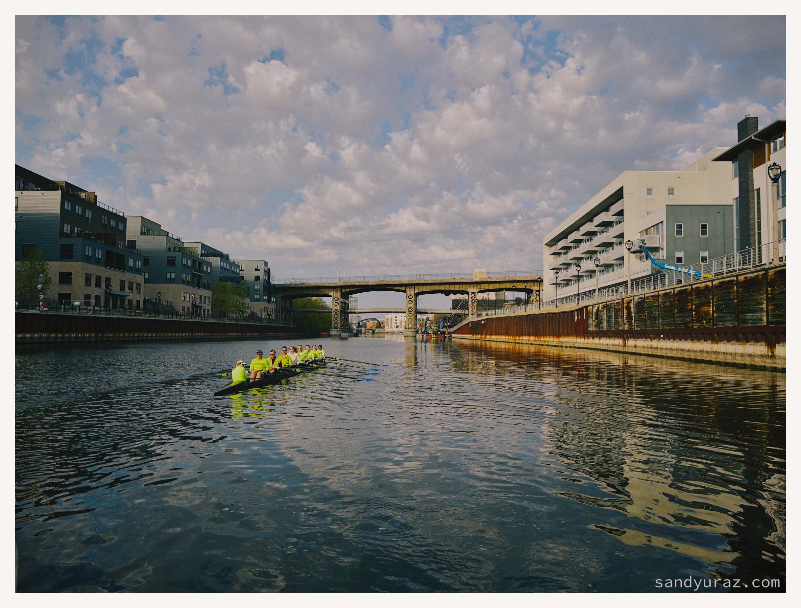
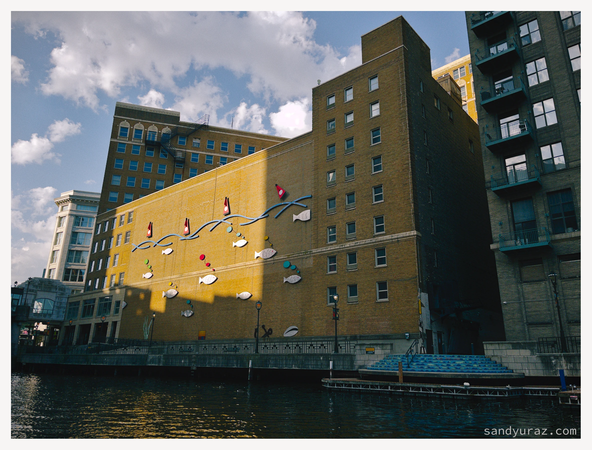
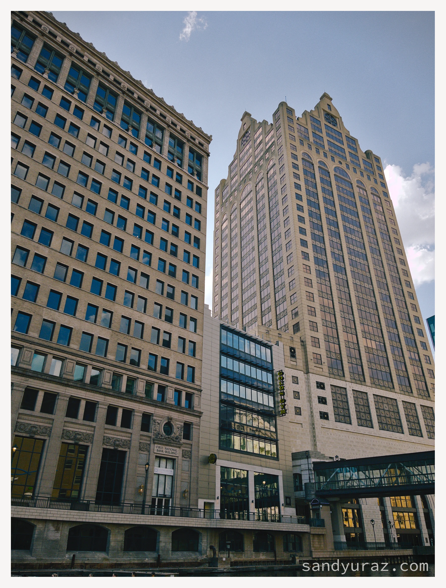
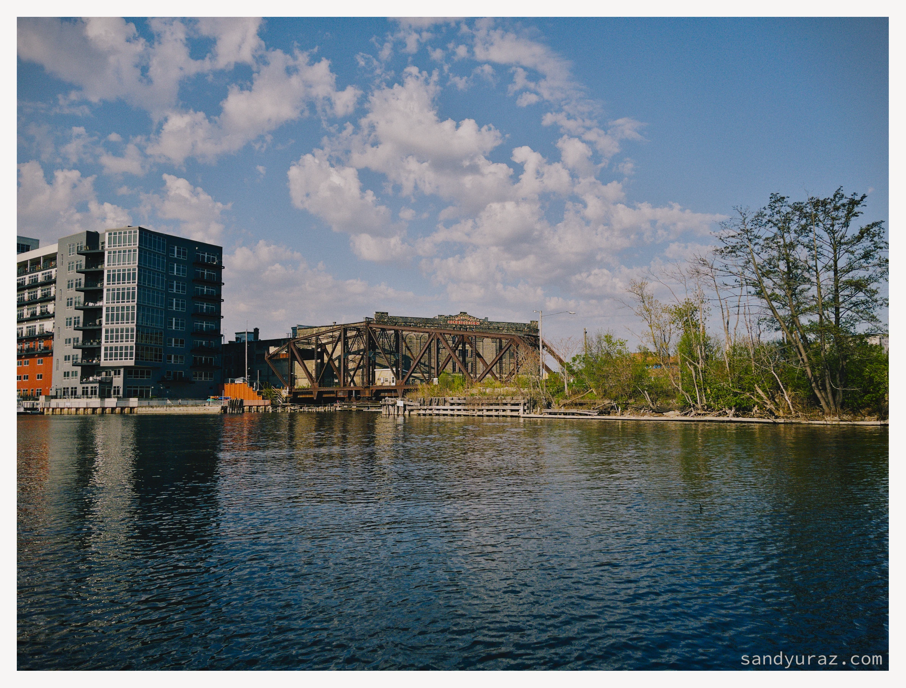

#+html_head: <link rel="stylesheet" type="text/css" href="milwaukee.css">
* Milwaukee River

On this little stroll across the Milwaukee River have I realized it might be one
of the best ways to experience the cityscape; seeing it all from the angles that
not all might get to thus getting to witness the secret parts of the banal.

But before we even get to board our ship, we saw this little hole in the
wall---literally, a hole in the wall---and in its place there was a tiny
apartment with occupancy of one of the little mouse living its cozy life. How
cute is that! I have a good feeling about this.

#+begin_gallery
- [[2025-05-10 tiny house full.webp][What's there in the wall I see?]] :flex 45 :no-zoom
- [[2025-05-10 tiny house front.webp][It's a tiny mouse in the wall!]] :flex 50 :no-zoom :v-flex 50
- [[2025-05-10 tiny house right.webp][That is some pretty cool wall art]] :no-zoom :v-flex 95
#+end_gallery

This whole trip had been arranged by our friend, who's also working with the
rowing club over here, so we got to enjoy the motorized boat with a view on all
the folks who had to row their big kayaks manually. Their approach was
healthier, but ours let us enjoy the view more without literally sweating; we
were in fact freezing from how under-dressed we were for the occasion.

#+begin_gallery
-  :flex 50 :no-zoom :v-flex 50
-  :no-zoom :v-flex 95
-  :flex 45 :no-zoom :flex-break
#+end_gallery

Back in the day they used to have companies named exactly after what they do,
not some silicon valley-esque names with missing vowels for the ``coolness'' of
it, but, simply, ``/Milwaukee Cold Storage/'' or ``/Milwaukee Iron Company/''
and even ``/Milwaukee Chair Company/''. In a way, you box the competitors out
completely, since, if they want to make chairs, are we going to buy chairs from
*the* chair company, or ``Jeff's Chairs?''

#+begin_gallery
-  :flex 80 :no-zoom
#+end_gallery

Typing this out on the plan with my trusty emacs and recalling the day, all I
could see is the blinding sun, which I wouldn't call that good of a friend of
mine that day, since it felt as if it emitted no warmth; as I sat
motionless---that's on me---and freezing every bit of my body that could feel
such a sensation. But man, it was beautiful. I grew up in lands that don't have
many bodies of water, so this experience of traversing the city and seeing its
inner workings: the drainage systems, buildings I'd never see from my own two
feet, and many unreachable spots with writings and graffiti that I have no clue
how someone would get to them in the first place, this experience felt special.
