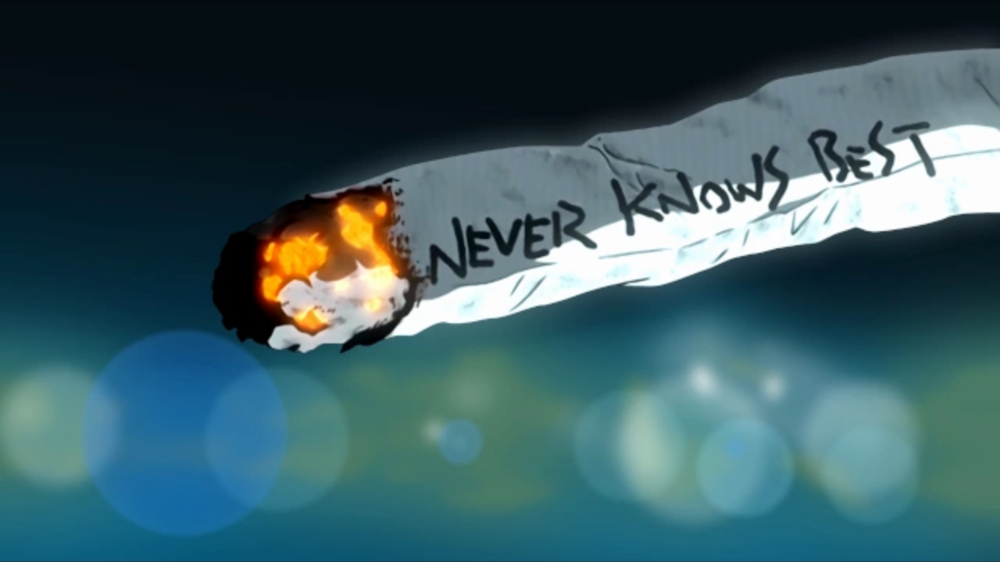

FLCL 🎸
======

52; 12022 H.E.

One time I heard someone describe FLCL as a fever dream of an anime. I
think this reaction is justified, yet doesn\'t do it the full honor it
deserves. FLCL is by far **the most unique and thrilling** anime I have
ever seen. Not only by its animation style choice, not only by its plot,
not only by the ideas it's evoking, but with the combination of
everything listed and more, it creates something truly wonderful.

My close friends know that I have a weak spot for GAINAX and TRIGGER
works, especially anything that Hiroyuki Imaishi touches. This one is no
exception. It\'s a bit of an old show, the same year that I was born,
the wild 2000. It\'s freely accessible on
[youtube](https://www.youtube.com/playlist?list=PLWyV9Ojt6_BlwTmnDtvHTCtq1cpUTz5Hr).
There are only six 20 minute long episodes, so it would be blasphemous
of you not to watch it. This post will be a little different, because
the show is **so short**, yet **so incredibly dense**, I\'ll be making
quick comments on my favorite parts and linking other essays that will
do a better job explaining the core of Fooly Cooly.

FLCL is furiously fast-paced, unapologetic in what it is trying to do,
and most of all, it is also **highly** experimental. Everything ranging
from the art style, creative design choices, all the way to voice
acting, and character-building is something you would not witness
anywhere else, not even close. Oh my god, FLCL is accompanied by
fabulous [the pillows](http://pillows.jp), whose songs go so hard that
it almost feels as if it came from outer space. Please give the one
below a good listen.

<iframe width="100%" height="330px" src="https://www.youtube.com/embed/acrLRi7juX8" frameborder="0" allow="accelerometer; autoplay; encrypted-media; gyroscope; picture-in-picture" allowfullscreen></iframe>

Have you ever seen a [whole
scene](https://youtu.be/qmYt-zAW2aY?list=PLWyV9Ojt6_BlwTmnDtvHTCtq1cpUTz5Hr&t=656)
animated as if it were a manga? I\'m not talking about *Yakuza Turned
Housewife*, which is a PowerPoint with voices over. I\'m talking about a
fully dynamic scene, where the camera actively pans from one part of the
manga page to another, where the manga itself is animated and truly
brought to life. It takes some real creativity and courage to show such
a scene to your audience.

Inexplicably, no matter how crazy the plot is, how little we know about
anything that\'s happening in front of our eyes, or how more and more
surreal the feelings get, FLCL accomplishes brilliantly at reducing the
emotional friction between you and the show\'s atmosphere to something
very close to nil. It absorbs you into its world, into its commitment to
its belief, while keeping you energetically warm and excited for what
comes next. This is the best I can put when typing this late at night,
just because I felt I had to write about it.

Fooly Cooly is a coming-of-age story. Accepting yourself, your life,
taking responsibility for your actions, stopping whining about life, and
instead, living it with everything you are given in the moment of now.
You may consider all the characters as little kids that can\'t show you
anything worthy of your attention and that would be your first mistake,
and prove that the above claim doesn\'t hold.

If [someone](https://kitsu.io/users/AngMang) tells me Mamimi is their
favorite character, or any character from FLCL at that point, I would
immediately know they do be real for that. There is something so genuine
about the problems, desires, and conflicts that our characters face,
such that for a regular modern viewer, it may seem all too boring or
naive. I would dare to say that people making those claims lack the
subtlety of a soul, of their emotional harmony to be able to notice
thin, yet thrilling currents flowing in and out.

[Hiding in
Public](https://www.youtube.com/channel/UCVbpA94Zek3v6wZ8E2Dh60g) has
produced one of the best anime video essays I have ever seen on the
platform. Highly recommend watching his [The Lie of Relationships in
FLCL](https://youtu.be/Jk8rHHMS0FY) and [They\'re
Fake](https://youtu.be/FCEaZxahYiQ). It goes over some of the main
topics very well, to the point that I would rather not paraphrase his
thoughts into my own, better watch and enjoy the source. Thank you for
keeping up with me on this absurd post I wrote falling asleep. It is my
wish that people could enjoy FLCL for what it is, embrace all the drugs
it's on, and truly become a [Fooly Cooly
connoisseur](https://www.urbandictionary.com/define.php?term=Fooly+Cooly).
