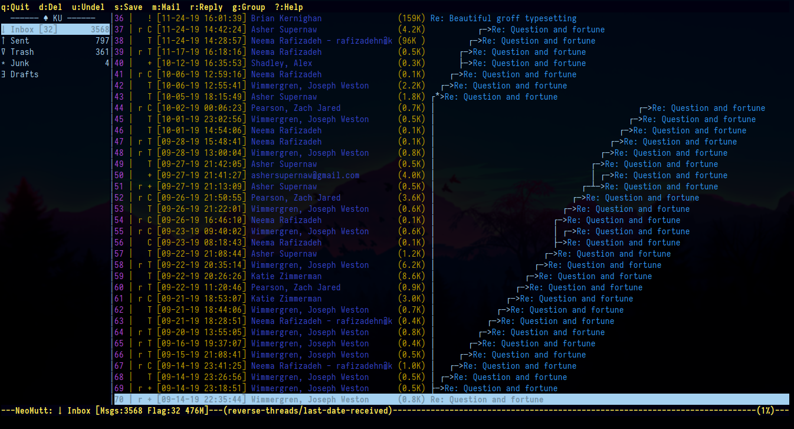

= Advanced Neomutt
Sagindyk Urazayev <ctu@ku.edu>
LinkedIn_LINK | GitHub_LINK | Resume_LINK | PGP Key_LINK | Home_LINK
:toc: left
:toc-title: Table of Adventures

[abstract]
.Abstract

Hello there! This is an article on advanced neomutt features that might
have been missed in my link:../using_mutt[previous article] on
(neo)mutt. This page has been inspired by
https://github.com/neomutt/neomutt/issues/1958[some of the issues] I had
with neomutt and the fantastic neomutt community.

== Named Mailboxes

With release https://github.com/neomutt/neomutt/tree/20191102[20191102],
neomutt team has introduced named-mailboxes features, which allows you
to name your mailboxes (duh) in the sidebar. It can be used for some
pretty creative things, like setting a mailbox different to what you
have in your `.mail` directory, change the language, or make delimeters.
For example, here is an excerpt from one of my neomutt accounts that is
tied to my KU mail account

[source,example]
----
set folder="~/.mail/kumail"
set spoolfile = +'INBOX'

set trash = +'Deleted Items'
set postponed = +'Drafts'
set record = +'Sent Items'
named-mailboxes "  ―――――― ♠ KU ――――――  " =Journal
named-mailboxes "↓ Inbox" =INBOX
named-mailboxes "↑ Sent" ='Sent Items'
named-mailboxes "∇ Trash" ='Deleted Items'
named-mailboxes "∗ Junk" ='Junk Email'
named-mailboxes "∃ Drafts" ='Drafts'
----

After launching neomutt, it gives me nice custom sidebar with a dope
delimeter

[source,example]
----
  ―――――― ♠ KU ――――――   │ 1 |   [11-27-19 12:03:35] Mom       Did you buy eggs?
↓ Inbox [32]       3568│ 2 |   [11-27-19 09:07:01] Bill      All rights reserved.
↑ Sent              797│ 3 |   [11-27-19 06:07:02] Lao Tse   Difficult Paths
∇ Trash             359│ 4 |   [11-27-19 06:59:18] Mando     This is the way
∗ Junk                4│ 5 |   [11-26-19 22:59:02] BlondiXXX How much does she love you?
∃ Drafts               │ 6 |   ...
----

`named-mailboxes` also work with multiple accounts. You can use some
garbage mailboxes (looking at you, Journal) as delimeters.

== Threads

I have been looking around how to do threads and I finally found out
how. Usually, mutt just gives you your mail all in one blob of a list.
With threads, you can have beautiful trees of replies, threads,
forwards, and more! To trigger that, just add this to your `.muttrc`

[source,example]
----
set sort = 'reverse-threads'
set sort_aux = 'last-date-received'
----

This is how it looks with huge mail chains

.Fortune mailchain with threads enabled

For ease of use, you can add the following line to bind your `c` key to
collapse threads

[source,example]
----
macro index c <collapse-thread> "collapse-thread"
----
