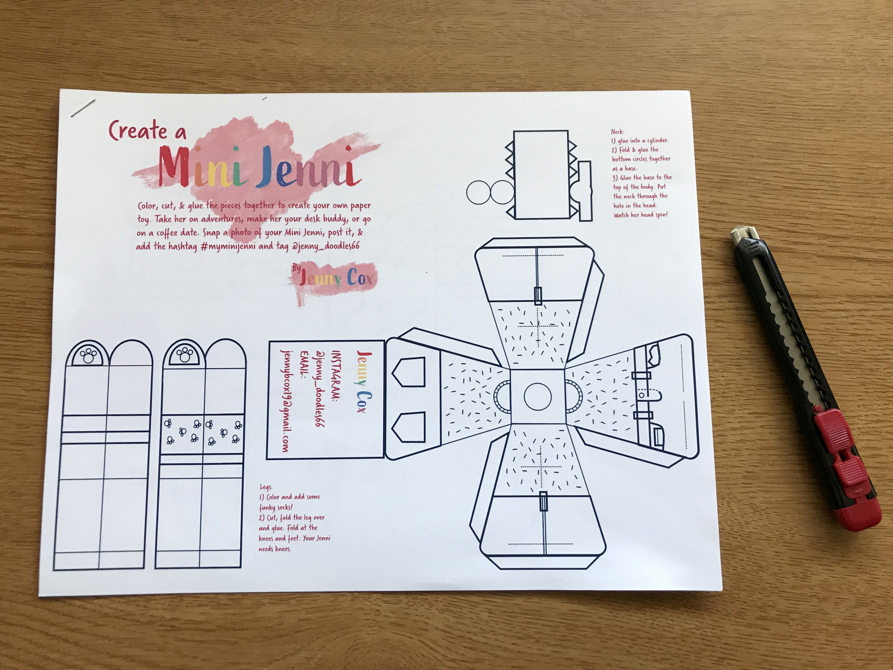
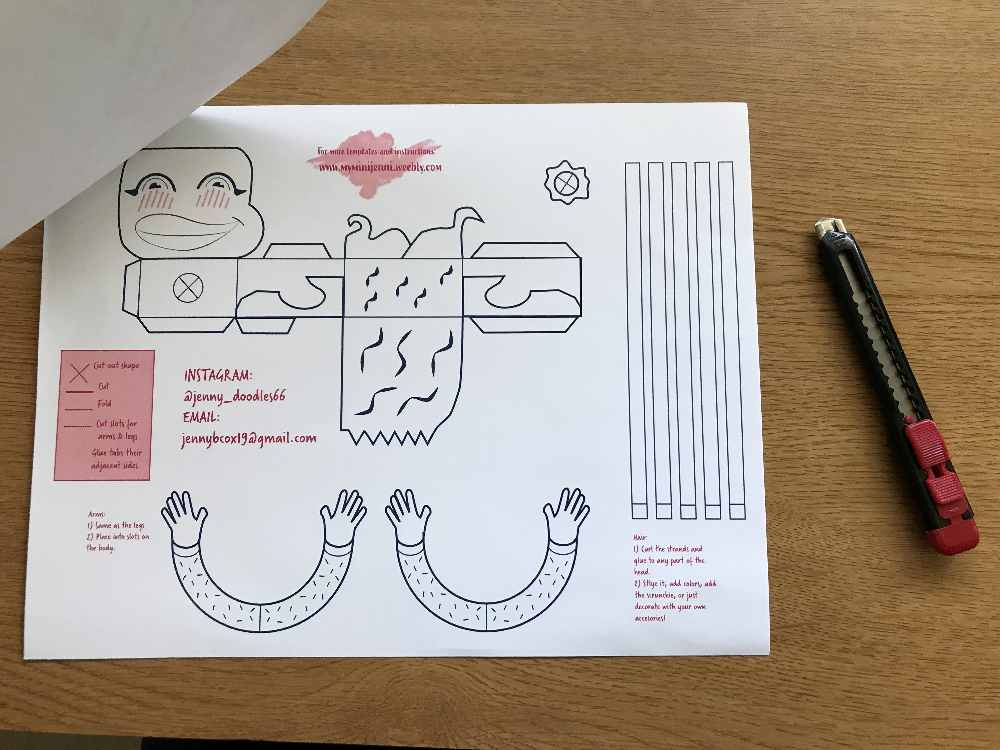
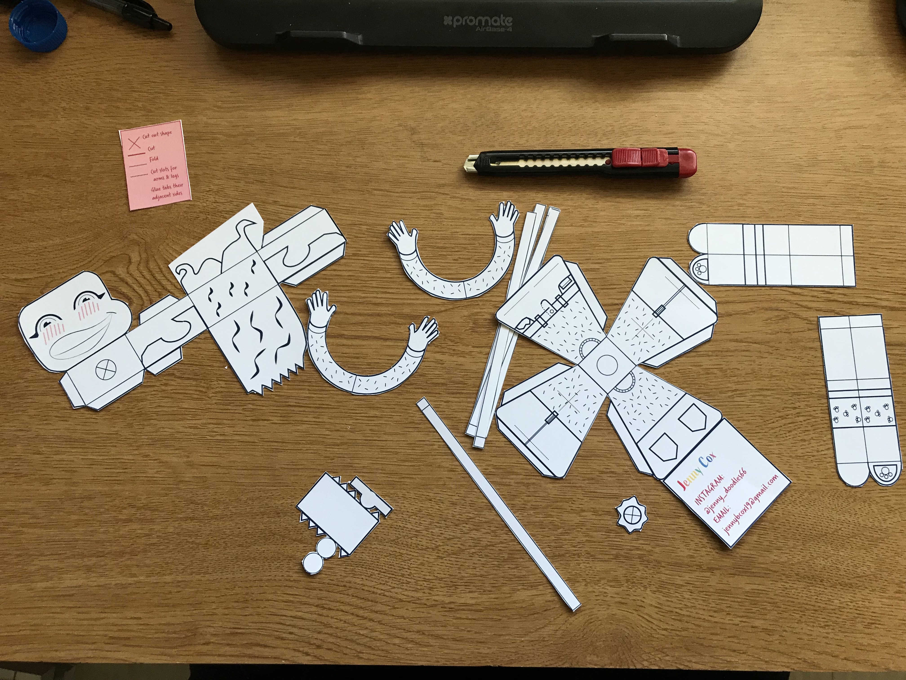
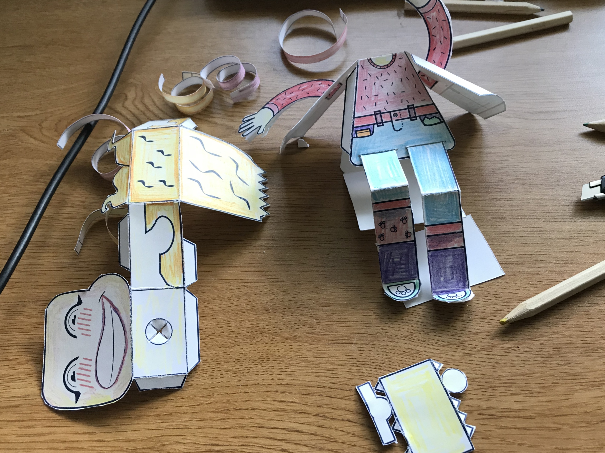
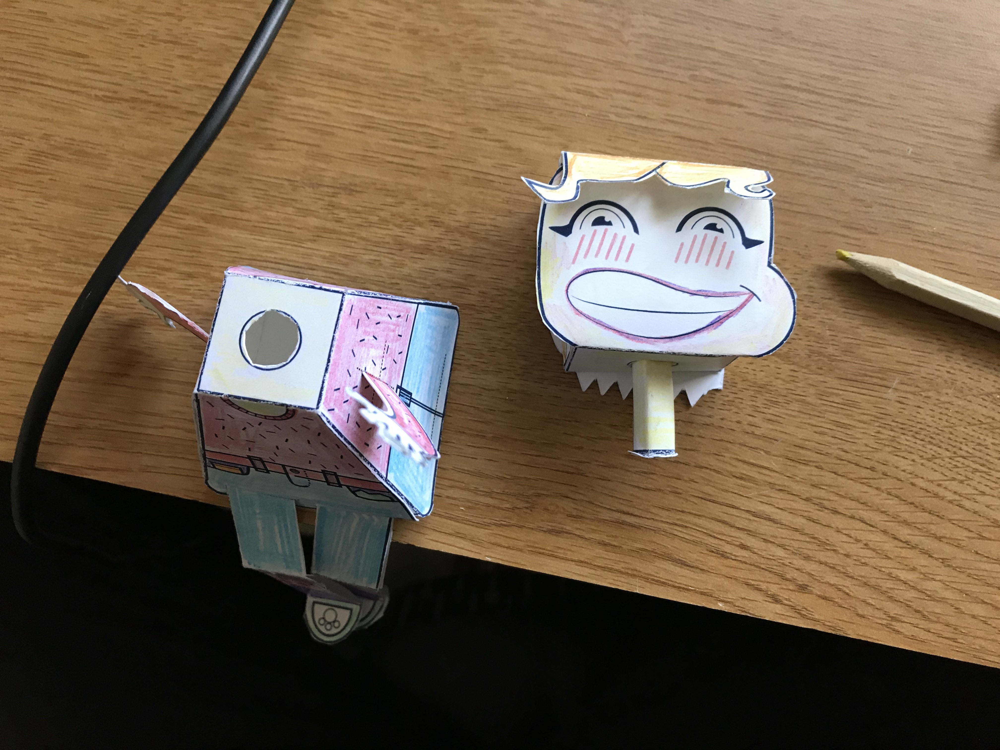
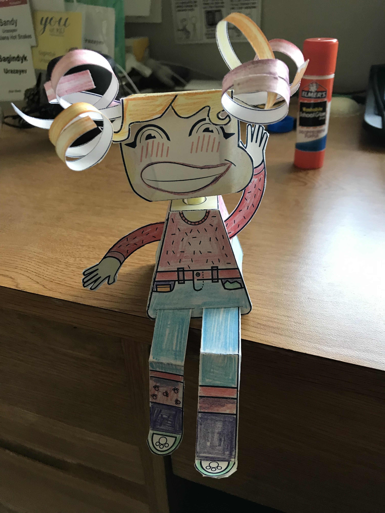
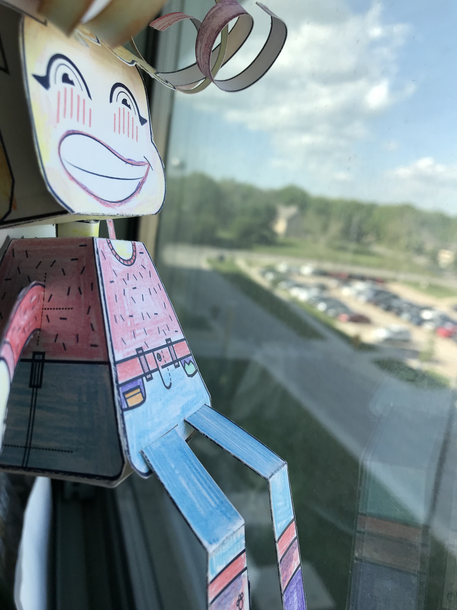
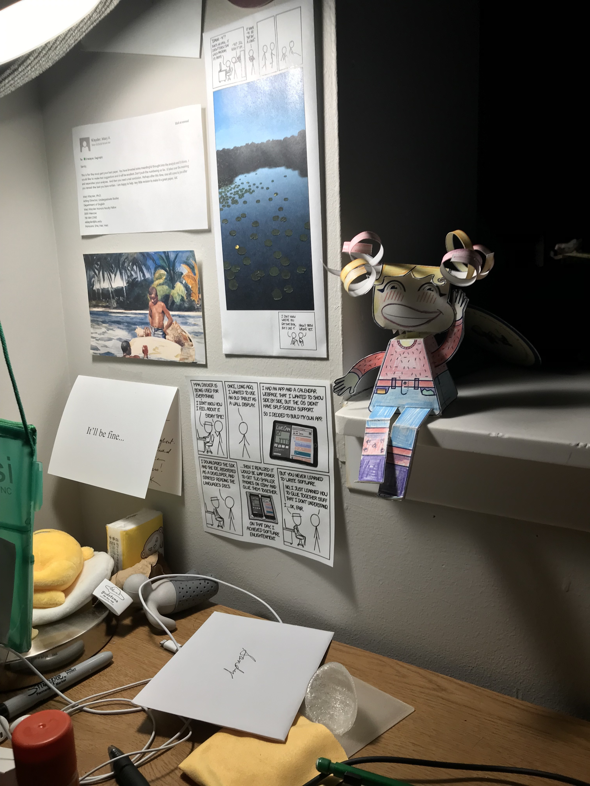

= Mini Jenni - my new best friend =
Sagindyk Urazayev <ctu@ku.edu>
LinkedIn_LINK | GitHub_LINK | Resume_LINK | PGP Key_LINK | Home_LINK

== Introduction ==

This is just a showcase of my building process of my new best friend -
link:https://myminijenni.weebly.com/[Mini Jenni],
made by Jenny Cox. Before the pictures start pouring in, I want to say that this
is not an advertisement, I do not personally know Jenny Cox, and I am not being
paid in any way for endorsing the figure.

I just liked it.

== Building ==

[#pic1]
.Step 1

[#pic15]
.Step 1.5

[#pic2]
.Step 2

[#pic3]
.Step 3
image::pic3.jpg[width=300, role="left", link="./pic3.jpg"]

[#pic4]
.Step 4

[#pic5]
.Step 5

== Final pictures ==

[#fin 1]
.Final 1

[#fin2]
.Final 2

[#fin3]
.Final 3

