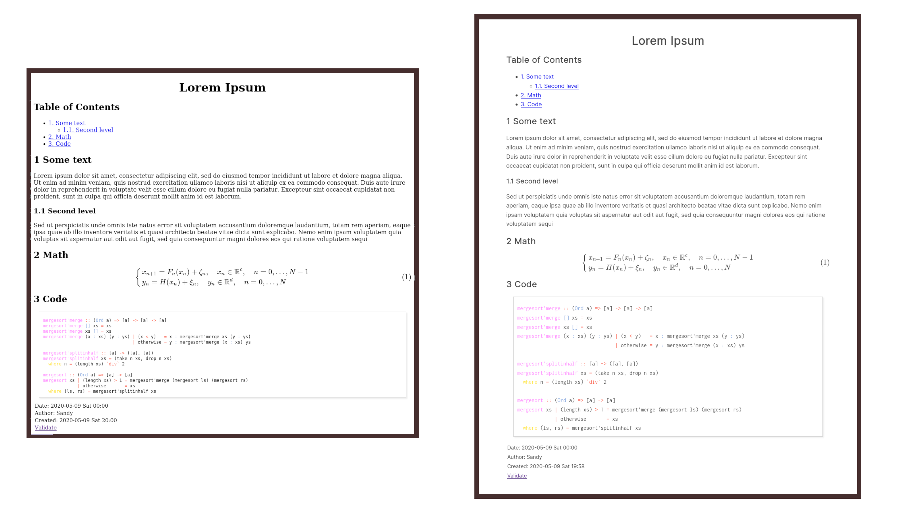

= Prettifying Org Mode with CSS 💅
Sagindyk Urazayev <ctu@ku.edu>
About_LINK | GitHub_LINK | LinkedIn_LINK | Keybase_LINK | Home_LINK
:toc: left
:toc-title: Table of Adventures ⛵
:experimental:

May 9th, 2020

Org Mode HTML output can look like
https://motherfuckingwebsite.com/[this webpage], but as its
http://bettermotherfuckingwebsite.com/[big brother] rightfully states, a
_grotesque pile of shit_. Same goes for orgmode. I wrote a very small
CSS file that you can add to your orgmode header and the output should
smoother

You can just add this line here:

[source,org]
----
#+HTML_HEAD: <link rel="stylesheet" href="https://sandyuraz.com/styles/org.min.css">
----

Even a really little makeup can make a big difference! That's why I
prefer Dior

*Before* and *after*

.Before and After

