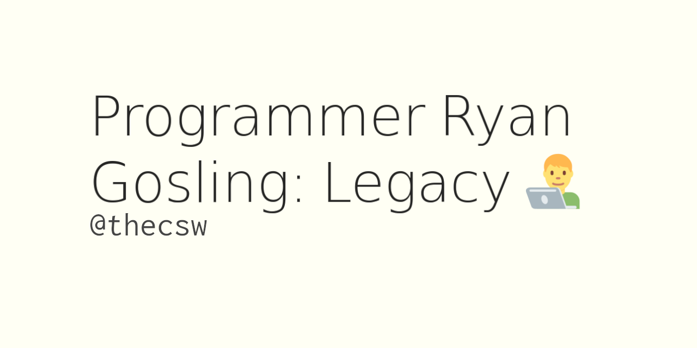

Programmer Ryan Gosling: Legacy 👨‍💻
===================================

April 2nd, 2020

Memes are great and in many ways, **define** who we are. Couple of
months ago, I found one of the best meme goldmines. [Programmer Ryan
Gosling](https://programmerryangosling.tumblr.com/) I fell in love with
it instantly. I love Ryan since the first time I saw him in
[Drive](https://en.wikipedia.org/wiki/Drive_(2011_film)) and I who
doesn\'t enjoy a bit of
[r/ProgrammerHumor](https://www.reddit.com/r/ProgrammerHumor/)?
Unfortunately, the stream of content discontinued since Feb 14th, 2014
(*what a coincidence*). Heart breaking. My good friend, Malena and I
tried to make few of them and post here. If you wish to submit some for
our own amusements and yours, feel free to send it to **c t u AT k u DOT
e d u**

PICTURE agile.jpg:Agile:310:left

PICTURE oom.jpg:OOM Killer:310:left

PICTURE mst.jpg:Master Branch:310:left

PICTURE stack.jpg:Stack:310:right

PICTURE list.jpg:List:310:right

PICTURE dfa.jpg:DFA:310:right
