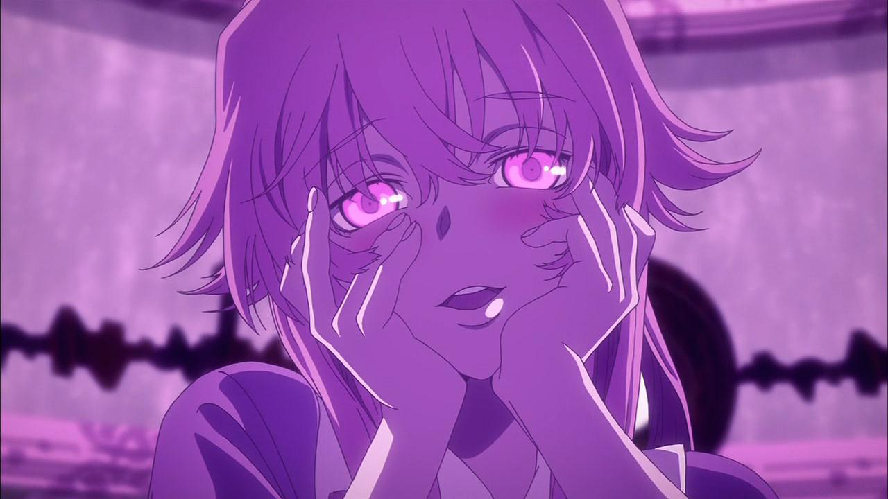
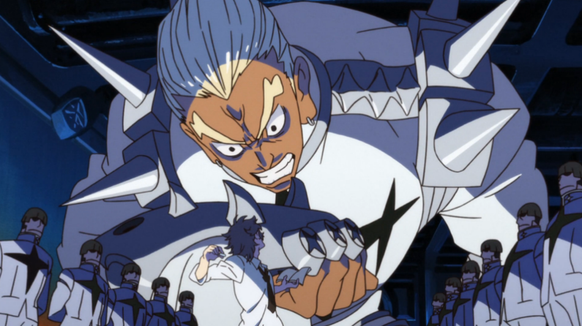

= I love watching anime 🎻
Sagindyk Urazayev <ctu ku edu>
About_LINK | Bookshelf_LINK | Fortunes_LINK | Home_LINK
:toc: left
:toc-title: Table of Adventures ⛵
:nofooter:
:experimental:

12; 12020 H.E.

I love watching anime. It hasn't always been like this. I think first
time I got introduced to it was when I was around six or seven. I was
living in Bulgaria at that time, I don't think we even had Cartoon
Network. A small TV somewhere on our backyard porch would run
https://en.wikipedia.org/wiki/Pokémon:_Indigo_League[Pokémon: Indigo
League] on some unnamed channel, which I think is as far as you can go
in terms of animated pokemons. I was waiting patiently for every "new"
episode after coming back home from school. Then there was a long break.

I briefly came back to watching anime when my best friend in high school
recommended me watching Steins;Gate. I liked the genre a lot. It was of
course the time when I was super young and many concepts might have
flown right past me. Right after, my second serious watch was Mirai
Nikki. You are probably more familiar with it through this picture of a
girl seductively looking at you.

.Yuno Gasai's yandere expression

As a 15 year old high school boy, I loved the show. The things happened
in the show and scenes presented, I've never seen anything like it in
movies or books. It was brash, suggestive, violent, and uncompromising.
My friend from before scolded me a little bit, saying it's a low-tier
show that is just about a yandere girl running around and basically
killing everyone. Finally, I finished that small high school era of
anime with Kill la Kill. I was just *obsessed* with it, especially with
Ryūko Matoi. I bored my other friend so much that she drew me Ryūko
dressed in her transformed Kamui. Thank you, Meruel.

Now we're here. Almost five years later, I re-sparked my love for the
genre once again and oh boy, it came in blazing *big time*. Right around
the last days of 2020, I started watching Darling in the Franxx. Flew
back home and finished it there by staying up till 3am and grinding the
episodes. It was something about the timing when the show came into my
life and my personal state. It clicked so perfectly, I got hooked like
an addict. Absolutely fell in love with Zero Two ❤️. Since then, watched
the hits of Gainax, all of Trigger, and more. Now we are done with this
exhaustive history. Let's talk about anime.

There is so much that anime can do, which almost every single other
genre is practically incapable of doing. A simple example, would be the
fight scenes and their dynamics. Think of books as a media. The heat and
action of it almost entirely depends on author's way of words and your
imagination. Live action films with real actors and no matter what
amount of CGI you throw at it, never reaches the heat an anime can,
simply because they are still bound by how real life looks. You can't
enlarge someone 10x and make it as intimidating as Ira Gamagōri looking
down on students. It would just
https://en.wikipedia.org/wiki/Uncanny_valley[look goofy and unnatural].

.This is the 40th second of the first episode

Continuing on comparing the genres, you might ask, but what about
cartoons? Isn't anime just a cartoon genre? Well, in a very very trivial
sense, yes. However, "cartoons" usually refer to the Western animation
style, while "anime" refers to hand-drawn and computer animation
originating from Japan. Anime excels because it is cinematically shot as
if by a camera, including panning, zooming, and more complex angle
shots, which are really hard in practice. Western cartoons are very much
standardized in animation style, plot building, and their impact. They
feel bland. Anime can overcome that by tackling topics and themes no
regular cartoon would even come close to, while also employing a large
array of over-the-top action and scenes.

Okay, okay, so what's the actual appeal of anime to me? That is it. The
absolute freedom in plots and characters. Want to see a half-naked girl
fighting clothes with half a scissor? Kill la Kill. Want to see robots
as big as the Observable Universe smash each other? Tengen Toppa Gurren
Lagann. A man able to kill anyone with a single punch, even cosmos
overlords? One Punch Man. Conductors using their batons to fight aliens
with the power of Classical Music? Takt Op. Destiny. This list is pretty
tame, just the first ones that came to my mind. In many ways, it's so
unrealistic and many times so much far and beyond from our reality that
it can make some viewers dizzy or brush off the entire genre as too
phantasmagorical. I want to make a case that we need this too.

Let me give a little background into my experience with fine arts and
media. I major in Classic Literature. The number of greatest and most
"realist" works I've read and the amount of pages and analysis I wrote
on them is something I'm still recovering from. It doesn't get more real
than Russian Literature from 17-18th centuries, with the greats like
Gogol, Dostoevsky, and Tolstoy. I loved the books so much that I decided
to major in it. I adore realism and works that just crush your heart and
shatter your soul. There is some painful blood-ridden personal and
emotional growth in there. However, no matter how much I love it, it
would be impossible and dangerous to the psyche to constantly immerse
yourself in greatest and hardest books ever written.

With this little background, I want to assure you that my point of view
and love for Japanese animation is not driven just because I know
nothing else or stuck in it, as many people went to point that out. I am
intimately acquainted with all different genres, this leads me to
believe that what we need is the balance between them. We need the
over-the-top-crazy-impossible-phantasmagorical world that anime brings
and Russian-style-sad-real-dead-on realism. Only with understanding and
appreciating both ends of the spectrum, can we refine our tastes and
build more critical point of views on what we consume.

Anime gives a better breathing room, allowing to abstract yourself from
all the small swamp-like details and worries of life, project them onto
a world, where giant robots fight aliens in dashingly choreographed
ways. To the fullest sense, it inspires me. I drive out the energy and
stimulation from those shows to find a new perspective to many
situations in life and freshen up a bit, to dream. Anime is on the crazy
side of the spectrum, hard literature is on the opposite site of
crushing realism, we don't need anything in between. Our day-to-day
lives and routine already suffice for that.

Anime music is also *incredible*. Here is my playlist with the ones I
like a lot

SPOTIFYPLAYLIST 6P7ksZ5uGpVp4qq9gDhFlj

Thank you for reading! Take care
TOMB
