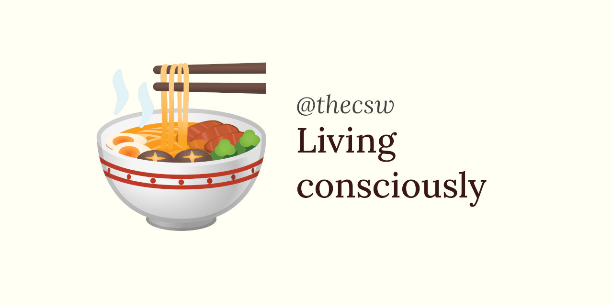

Living consciously 🍜
====================

Many go and ask themselves, *what is the meaning of life?* Some spend
their entire lifetimes to come up with an answer that they would feel
good or smart about. Many spiral themselves into self-imposed
depressions, worry without an end, and locking their minds into a
constant state of misery. All from a question on life\'s meaning. Is it
impossible to answer? Some would say so. Is the answer supposed to be
something grand, beautiful, and divine? That is what we can assume from
the effort that goes into it. Albert Camus said - \"The meaning of life
is whatever prevents you from killing yourself\". Franz Kafka proclaimed
- \"The meaning of life is that it ends\". I would like to assist my
dear authors with an answer that is like finest things we have - simple.

The meaning of life is to live. That is it.
