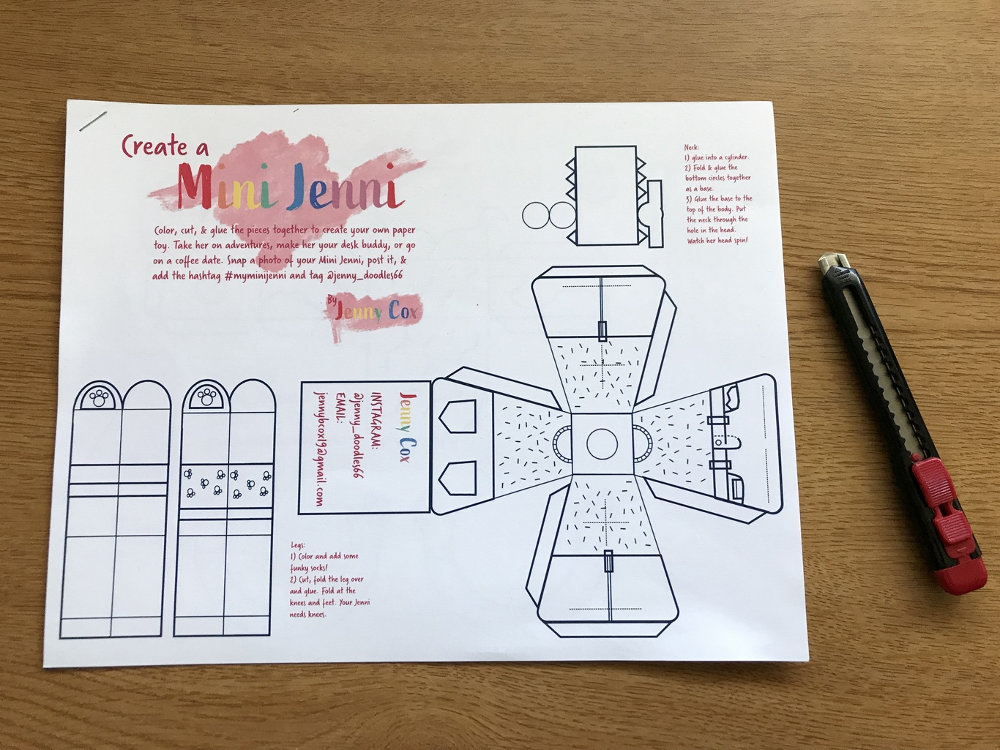
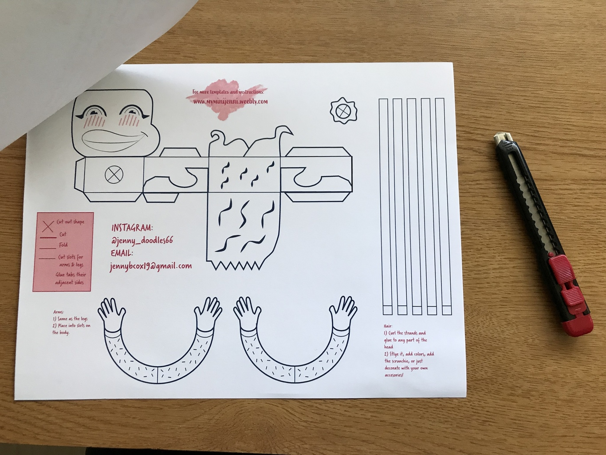
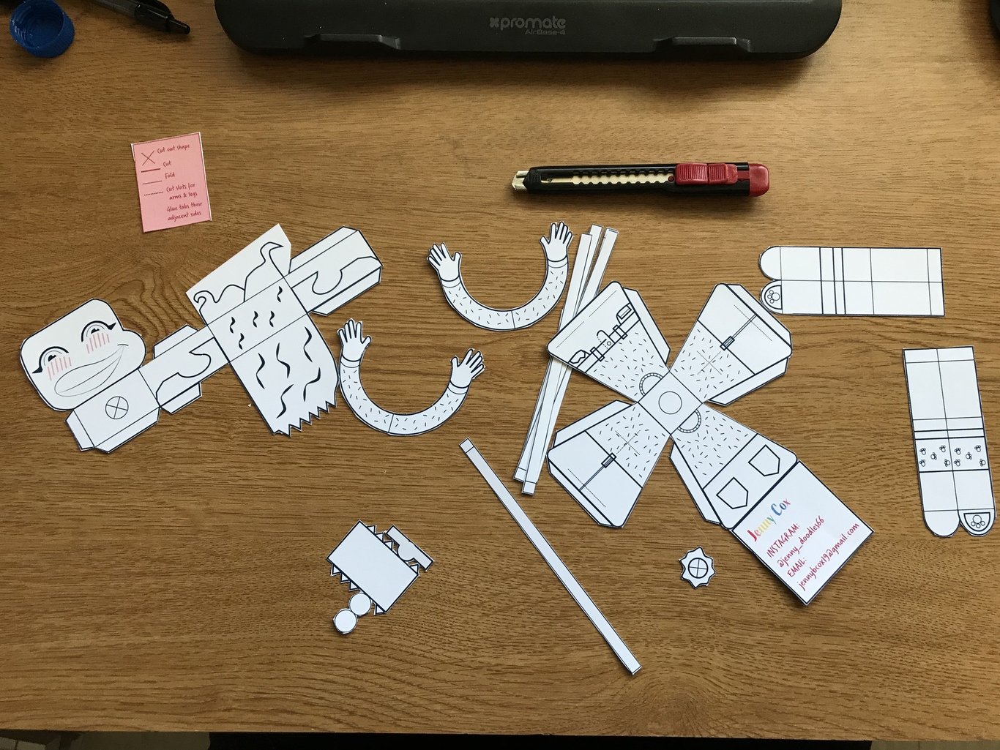
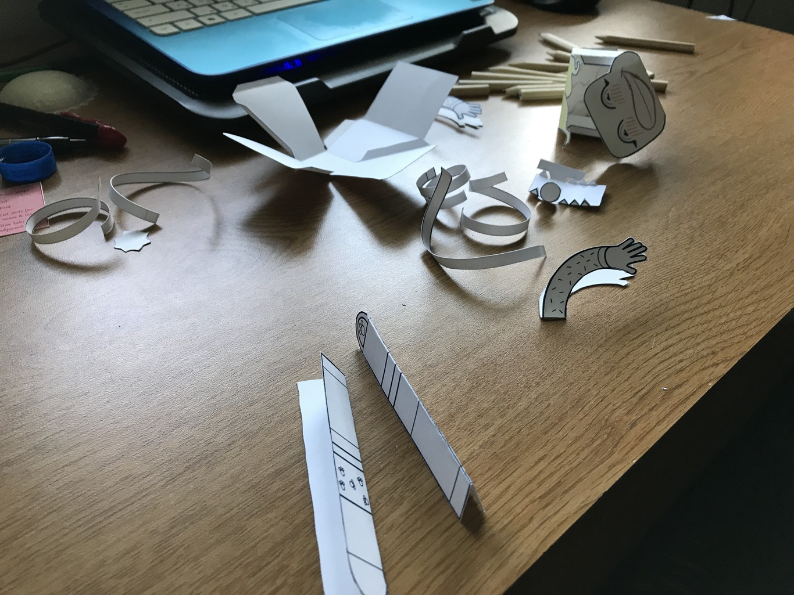
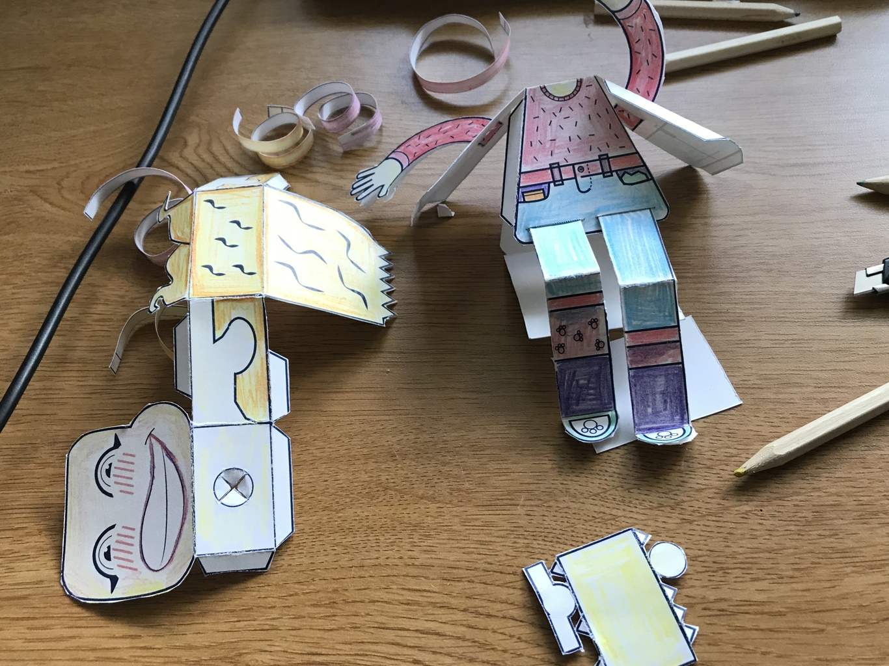
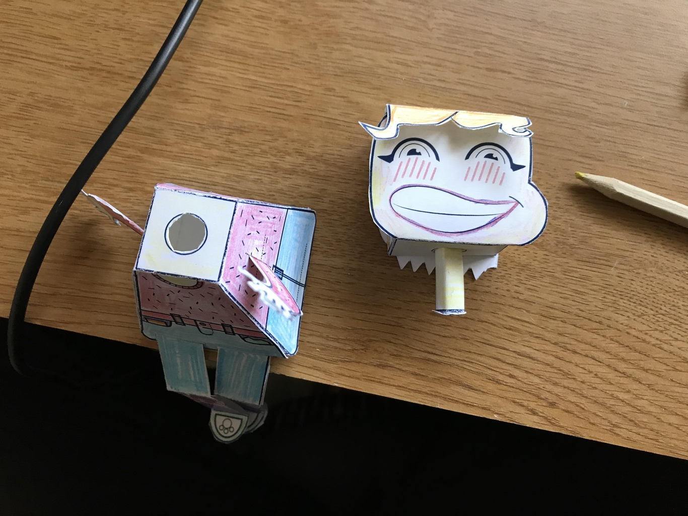
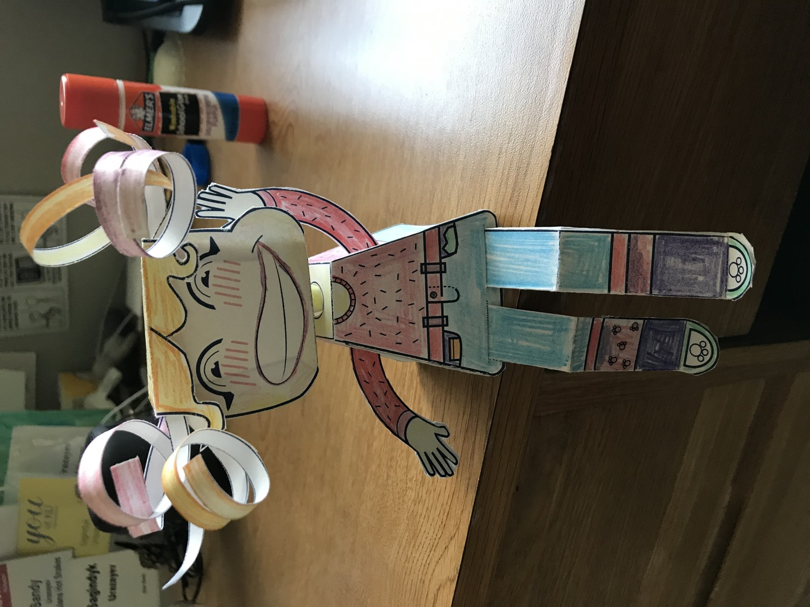
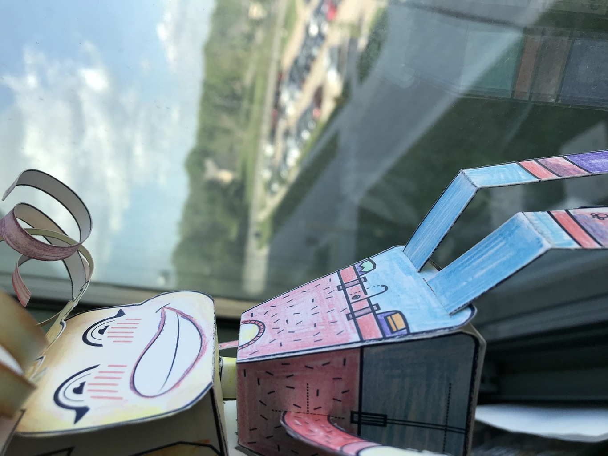
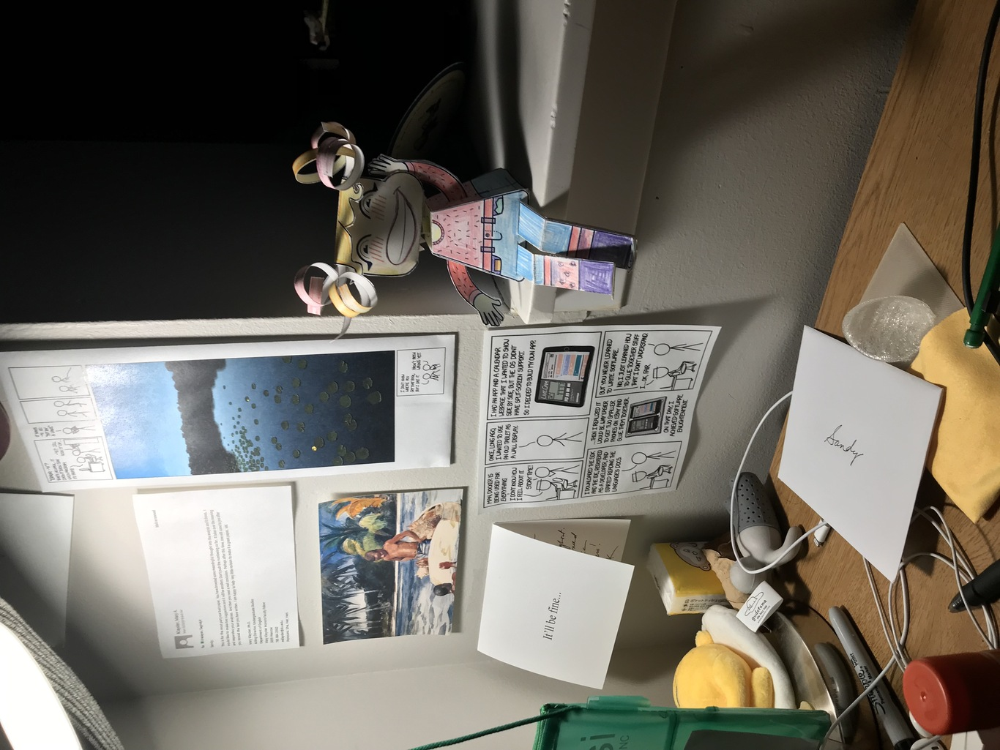

= Mini Jenni - my new best friend 👯‍♀️
Sagindyk Urazayev <ctu@ku.edu>
About_LINK | Bookshelf_LINK | Fortunes_LINK | Home_LINK
:toc: left
:toc-title: Table of Adventures ⛵
:nofooter:
:experimental:

May 16th, 2019

This is just a showcase of my building process of my new best friend -
https://myminijenni.weebly.com/[Mini Jenni], made by Jenny Cox. Before
the pictures start pouring in, I want to say that this is not an
advertisement, I do not personally know Jenny Cox, and I am not being
paid in any way for endorsing the figure.

I just liked it.

== Building

.Step 1

.Step 1½

.Step 2

.Step 3

.Step 4

.Step 5

== Final result

.Final I

.Final II

.Final III

TOMB
