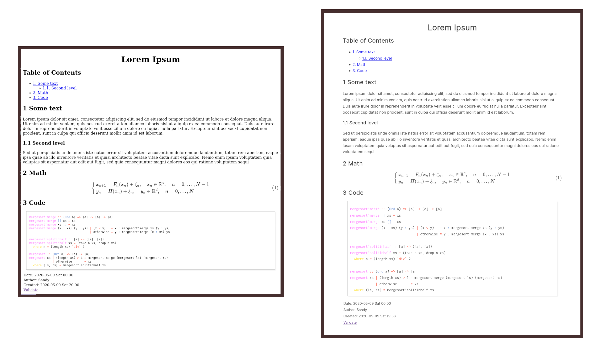

= Prettifying org-mode with CSS 💅
email <ctu [at] ku [dot] edu>
About_LINK | Bookshelf_LINK | Fortunes_LINK | Home_LINK
:toc: preamble
:toclevels: 4
:toc-title: Table of Adventures ⛵
:nofooter:
:experimental:
:figure-caption:
:figure-number:

May 9th, 2020

Org Mode HTML output can look like
https://motherfuckingwebsite.com/[this webpage], but as its
http://bettermotherfuckingwebsite.com/[big brother] rightfully states, a
_grotesque pile of shit_. Same goes for orgmode. I wrote a very small
CSS file that you can add to your orgmode header and the output should
smoother

You can just add this line here or just use the bare CSS as a starting
point to make your own (everyone has their own style):

[source,org]
----
#+HTML_HEAD: <link rel="stylesheet" href="https://sandyuraz.com/styles/org.css">
----

Even a really little makeup can make a big difference! There is a good
discussion about this article on
https://news.ycombinator.com/item?id=23130104[hackernews]!

NOTE: Please do not rely solely on the link above, this post is merely a
demo of how you can control your org html output. I update that org.css
quite frequently.

*Before* and *after* (click to enlarge)

.Before and After

TOMB
