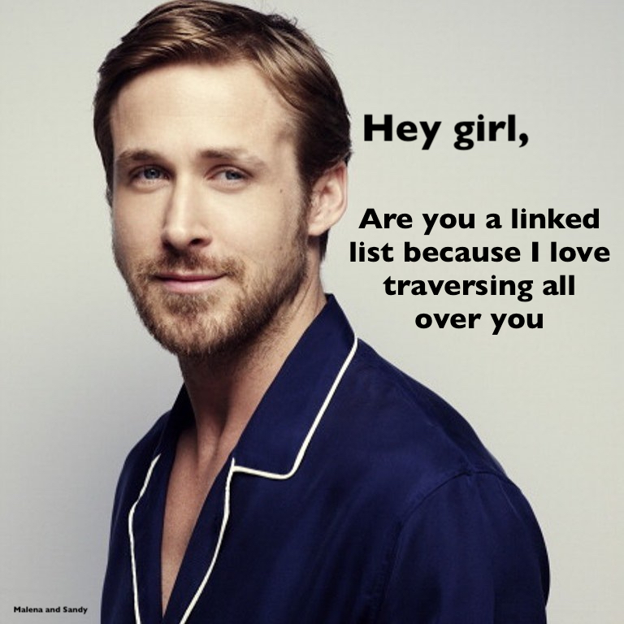

= Programmer Ryan Gosling: Legacy 👨‍💻
Sagindyk Urazayev <ctu@ku.edu>
About_LINK | Bookshelf_LINK | Fortunes_LINK | Home_LINK
:toc: left
:toc-title: Table of Adventures ⛵
:nofooter:
:experimental:

April 2nd, 2020

Memes are great and in many ways, *define* who we are. Couple of months
ago, I found one of the best meme goldmines.
https://programmerryangosling.tumblr.com/[Programmer Ryan Gosling] I
fell in love with it instantly. I love Ryan since the first time I saw
him in https://en.wikipedia.org/wiki/Drive_(2011_film)[Drive] and I who
doesn't enjoy a bit of
https://www.reddit.com/r/ProgrammerHumor/[r/ProgrammerHumor]?
Unfortunately, the stream of content discontinued since Feb 14th, 2014
(_what a coincidence_). Heart breaking. My good friend, Malena and I
tried to make few of them and post here. If you wish to submit some for
our own amusements and yours, feel free to send it to *c t u AT k u DOT
e d u*

.Agile

.OOM Killer
image::oom.jpg[OOM Killer, width=610, role="center", link="oom.jpg"]

.Master Branch
image::mst.jpg[Master Branch, width=610, role="center", link="mst.jpg"]

.Stack
image::stack.jpg[Stack, width=610, role="center", link="stack.jpg"]

.List

.DFA
image::dfa.jpg[DFA, width=610, role="center", link="dfa.jpg"]
