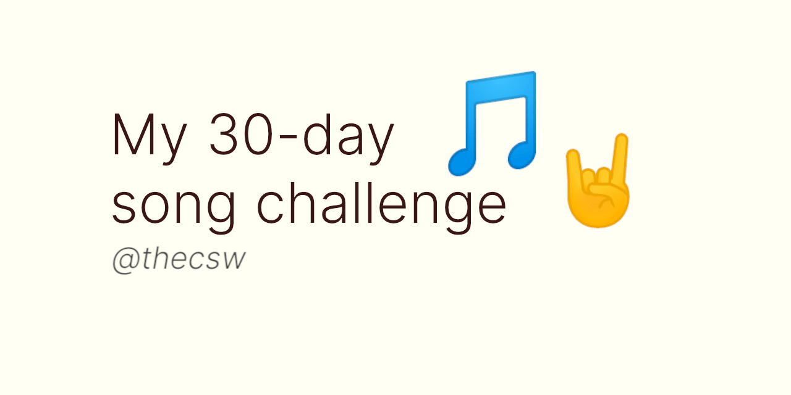

== My 30-day song challenge 🎵🤘

June 5th, 2020

=== The insta story

With my new https://www.instagram.com/sandy_uraz/[insta], I decided to
do my first song challenge where I have to put a new song every day,
which matches that day's description. Here we go!

Also, here is the
https://www.instagram.com/stories/highlights/17848385216106957/[original
story reel].

NOTE: It can take a hot second to load all the embeds! Some songs are
not available (???), though the track IDs are all correctly entered. I
will also add the name of the song in the text so you can see what it
was

==== Day 1: A song you like with a color in the title

_Blue Moon_ by Frank Sinatra

<iframe src="https://open.spotify.com/embed/track/5RLzsVW6UNiV2YrOlKwzNN" width="79%" height="80" frameborder="0" allowtransparency="true" allow="encrypted-media"></iframe>

==== Day 2: A song you like with a number in the title

_One More Time_ by Daft Punk (💌)

<iframe src="https://open.spotify.com/embed/track/0DiWol3AO6WpXZgp0goxAV" width="79%" height="80" frameborder="0" allowtransparency="true" allow="encrypted-media"></iframe>

==== Day 3: A song that reminds you of summertime

_Bullets_ by Archive

<iframe src="https://open.spotify.com/embed/track/5zxJ3BZyd6BK2gX4b2RnB4" width="79%" height="80" frameborder="0" allowtransparency="true" allow="encrypted-media"></iframe>

==== Day 4: A song that reminds you of someone you'd rather forget

_Thrift Shop_ by Macklemore & Ryan Lewis

<iframe src="https://open.spotify.com/embed/track/4YMqbFcDIFiCBd02PzUBcM" width="79%" height="80" frameborder="0" allowtransparency="true" allow="encrypted-media"></iframe>

==== Day 5: A song that needs to be played loud

_Sway_ by Michael Bublé

<iframe src="https://open.spotify.com/embed/track/2ajUl8lBLAXOXNpG4NEPMz" width="79%" height="80" frameborder="0" allowtransparency="true" allow="encrypted-media"></iframe>

==== Day 6: A song that makes you want to dance

_Rebel Yell_ by Billy Idol

<iframe src="https://open.spotify.com/embed/track/4TIJ7zSBNejpoIPaWpWRKc" width="79%" height="80" frameborder="0" allowtransparency="true" allow="encrypted-media"></iframe>

==== Day 7: A song to drive to

_Nightcall_ by Kavinsky

<iframe src="https://open.spotify.com/embed/track/0U0ldCRmgCqhVvD6ksG63j" width="79%" height="80" frameborder="0" allowtransparency="true" allow="encrypted-media"></iframe>

==== Day 8: A song about drugs or alcohol

_Sex & Candy_ by Marcy Playground

<iframe src="https://open.spotify.com/embed/track/5mkGfmJGFZpwK9nA5amOhv" width="79%" height="80" frameborder="0" allowtransparency="true" allow="encrypted-media"></iframe>

==== Day 9: A song that makes you happy

_Feel_ by Robbie Williams

<iframe src="https://open.spotify.com/embed/track/2Ms33RTRCT6gArrpcrPxmo" width="79%" height="80" frameborder="0" allowtransparency="true" allow="encrypted-media"></iframe>

==== Day 10: A song that makes you sad

_Por una Cabeza_ by Horacio Rivera

<iframe src="https://open.spotify.com/embed/track/6DgvomZko5Rxpxh3V6RfGg" width="79%" height="80" frameborder="0" allowtransparency="true" allow="encrypted-media"></iframe>

==== Day 11: A song you never get tired of

_Living in the Shadows_ by Matthew Perryman Jones

<iframe src="https://open.spotify.com/embed/track/6gijbGNDNNJgT60Aj7UCyc" width="79%" height="80" frameborder="0" allowtransparency="true" allow="encrypted-media"></iframe>

==== Day 12: A song from your preteen years

_Stayin' Alive_ by Bee Gees

<iframe src="https://open.spotify.com/embed/track/4y6Lpn5EVSMoiAW9q42RO4" width="79%" height="80" frameborder="0" allowtransparency="true" allow="encrypted-media"></iframe>

==== Day 13: A song you like from the 70s

_Mr. Blue Sky_ by Electric Light Orchestra

<iframe src="https://open.spotify.com/embed/track/2RlgNHKcydI9sayD2Df2xp" width="79%" height="80" frameborder="0" allowtransparency="true" allow="encrypted-media"></iframe>

==== Day 14: A song you'd love to be played at your wedding

_Unchained Melody_ by The Righteous Brothers

<iframe src="https://open.spotify.com/embed/track/1jFhnVoJkcB4lf9tT0rSZS" width="79%" height="80" frameborder="0" allowtransparency="true" allow="encrypted-media"></iframe>

==== Day 15: A song you like that's a cover by another artist

_Amish Paradise_ by "Weird Al" Yankovic

<iframe src="https://open.spotify.com/embed/track/5r96TaQquRrlo3Ym3ZlSL2" width="79%" height="80" frameborder="0" allowtransparency="true" allow="encrypted-media"></iframe>

==== Day 16: A song that's a classic favorite

_Girl, You'll Be a Woman Soon_ by Urge Overkill (real shame this one is
unavailable, please listen to it if you can find a chance)

<iframe src="https://open.spotify.com/embed/track/5u6Woby9oKAF8LhhuxykH1" width="79%" height="80" frameborder="0" allowtransparency="true" allow="encrypted-media"></iframe>

==== Day 17: A song you'd sing a duet with someone on karaoke

_Let's Ride Into the Sunset Together_ written by Tony Vice and Jerry
Burnham, and performed by the Lost Weekend Western Swing Band, with
vocals by Don Burnham and Patty Kistner.

<iframe src="https://open.spotify.com/embed/track/17ozPYYjhdjiOYqVHjSt2j" width="79%" height="80" frameborder="0" allowtransparency="true" allow="encrypted-media"></iframe>

==== Day 18: A song from the year you were born

_Gimme More_ by Britney Spears (I really thought this was from 2000,
it's actually from 2007)

<iframe src="https://open.spotify.com/embed/track/6ic8OlLUNEATToEFU3xmaH" width="79%" height="80" frameborder="0" allowtransparency="true" allow="encrypted-media"></iframe>

==== Day 19: A song that makes you think about life

_Within_ by Daft Punk

<iframe src="https://open.spotify.com/embed/track/7Bxv0WL7UC6WwQpk9TzdMJ" width="79%" height="80" frameborder="0" allowtransparency="true" allow="encrypted-media"></iframe>

==== Day 20: A song that has many meanings to you

_Digital Love_ by Daft Punk

<iframe src="https://open.spotify.com/embed/track/5D06AhoBSkwDbgkuALoIot" width="79%" height="80" frameborder="0" allowtransparency="true" allow="encrypted-media"></iframe>

==== Day 21: A song you like a person's name in the title

_With Every Heartbeat_

<iframe src="https://open.spotify.com/embed/track/17FSlwAcuzwITI7cA1w0Lq" width="79%" height="80" frameborder="0" allowtransparency="true" allow="encrypted-media"></iframe>

==== Day 22: A song that moves you forward

_Perfect Day_ by Lou Reed

<iframe src="https://open.spotify.com/embed/track/4TOMI010Sd4ZAX4aZ5TS85" width="79%" height="80" frameborder="0" allowtransparency="true" allow="encrypted-media"></iframe>

==== Day 23: A song you think everbody should listen to

_Supreme_ by Robbie Williams

<iframe src="https://open.spotify.com/embed/track/4dZ3V71vsqSn9MJ18y8YaJ" width="79%" height="80" frameborder="0" allowtransparency="true" allow="encrypted-media"></iframe>

==== Day 24: A song by a band you wish were still together

_Money, Money, Money_ by ABBA

<iframe src="https://open.spotify.com/embed/track/29FNeqjOV2kPWGS55qhtGB" width="79%" height="80" frameborder="0" allowtransparency="true" allow="encrypted-media"></iframe>

==== Day 25: A song you like by an artist no longer living

_They Don't Care About Us_ by Michael Jackson

<iframe src="https://open.spotify.com/embed/track/3wuCCNCnBhJlwkIJTBZFiv" width="79%" height="80" frameborder="0" allowtransparency="true" allow="encrypted-media"></iframe>

==== Day 26: A song that makes you want to fall in love

_Something About Us_ by Daft Punk

<iframe src="https://open.spotify.com/embed/track/1NeLwFETswx8Fzxl2AFl91" width="79%" height="80" frameborder="0" allowtransparency="true" allow="encrypted-media"></iframe>

==== Day 27: A song that breaks you heart

_Por una Cabeza_ by Horacio Rivera

<iframe src="https://open.spotify.com/embed/track/6DgvomZko5Rxpxh3V6RfGg" width="79%" height="80" frameborder="0" allowtransparency="true" allow="encrypted-media"></iframe>

==== Day 28: A song by an artist whose voice you love

Straight-up missed this one. Oh well

==== Day 29: A song you remember from your childhood

Really couldn't come up with this one. Wasn't much of a music listener
back in the ol' days ¯\\_(ツ)__/¯

==== Day 30: A song that reminds you of yourself

_Veridis Quo_ by Daft Punk

<iframe src="https://open.spotify.com/embed/track/2LD2gT7gwAurzdQDQtILds" width="79%" height="80" frameborder="0" allowtransparency="true" allow="encrypted-media"></iframe>
