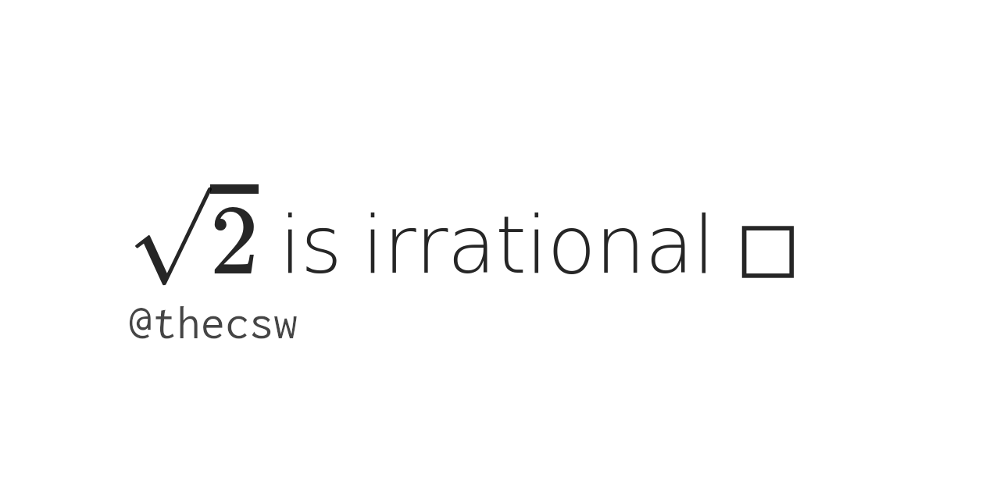

== latexmath:[$\sqrt{2}$] is irrational ◻

February 11th, 2020

=== Abstract

It's been a while since I wanted to install some math packages on my
website. Finally, I managed to do it by getting `asciidoctor-latex` and
running some quick `Makefile` magic. It looks like it's working fine!
Here is a simple proof that I've come to like over the years.

THEOREM

latexmath:[$\sqrt{2}$] is irrational.

PROOF

Let
latexmath:[$a,b \in \mathbb{Z} \quad, \frac{a}{b}=\sqrt{2},\quad b \neq 0, \quad (a,b)=1$]

Then latexmath:[$a=\sqrt{2}b$]

latexmath:[$\implies a^2=2 \times b^2 \quad (\Xi)$]

latexmath:[$\implies 2|a^2$]

latexmath:[$\implies 2|a$]

Then if latexmath:[$a$] is even,
latexmath:[$\exists k \in \mathbb{Z} \ni a = 2k$]

Then substitute into latexmath:[$(\Xi)$], we get
latexmath:[$(2 \times k)^2=2\times b^2$]

latexmath:[$\implies 4 \times k^2 = 2 \times b^2$]

latexmath:[$\implies 2 \times k^2 = b^2$]

latexmath:[$\implies 2|b^2$]

latexmath:[$\implies 2|b$]

If latexmath:[$a$] and latexmath:[$b$] are both even, it contradicts the
initial condition latexmath:[$(a,b)=1$].

latexmath:[$\therefore$] By Law of Contradiction, latexmath:[$\sqrt{2}$]
is irrational

USEMATHJAX
