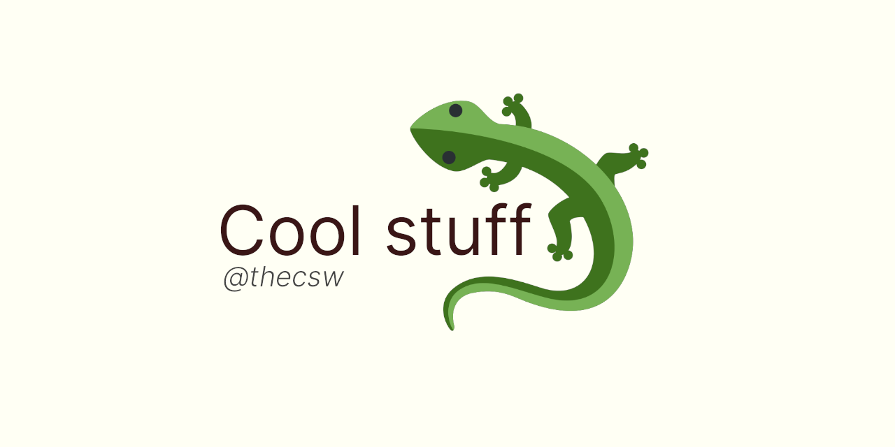

Cool projects ☕
===============

Some of the cool things I\'ve done over the years, such as projects,
websites, papers, etc! Hope you find something interesting for yourself

-   [Katya or The Liberated Corpus 🙈](./katya)
-   [The Art of Computer Science ❤️](./art)
-   [Writing a Unix shell in Go 🐚](./quash)
-   [Literate sorting visualizer 😎](./literate)
-   [Счастье маленького человека 🧥](./chelovek)
-   [Secure and cheap smart homes 🏠](./sandissa)
-   [Design a MIPS CPU in VHDL 💼](./mips)
-   [Write a compiler in C++ from nil 🍺](./crona)
-   [Cool pure C++ data structures 🏛](./algo560)
-   [Sandy\'s tutoring notes 📝](./tutor_sp21)
-   [Differential equations oracles 🧎‍♀️](./diffeq)
-   [Build a cheap self-driving car 🚗](./kaylee)
-   [Compress images with PCA 🎱](./lenna)
-   [L\'Hôpital\'s Rule cheatsheet 🏥](./lhopital)
-   [I write crypto in python 🍾](./crypto)
-   [Sentocks or Sentimental stocks 💇‍♀️](./sentocks)
-   [Reddit API wrapper for gophers 🎩](./mira)
