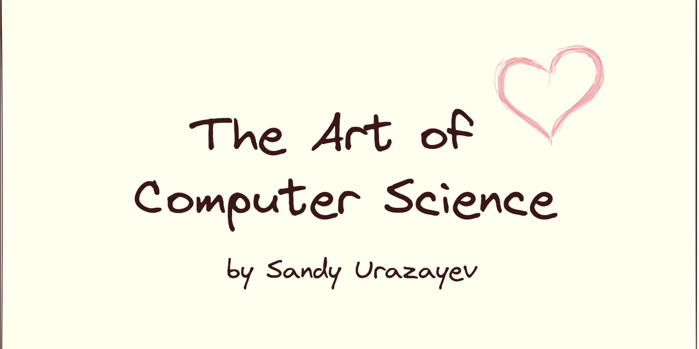

== The Art of Computer Science ❤️

My name is Sandy Urazayev and I would like to invite you to my talk “The
Art of Computer Science”. This talk has been sponsored by KU chapter of
ACM.

Follow me on a philosophical discussion of what is Computer Science?
What does that make us to be? Are we engineers, scientists, or artists?

Let us talk and ponder on something that no one else does. We will come
to revelations of our own and the future that awaits.

The presentation deck is link:./deck.pdf[available here].

<iframe width="100%" height="330px" src="https://www.youtube.com/embed/JjN-eE4kti8" frameborder="0" allow="accelerometer; autoplay; encrypted-media; gyroscope; picture-in-picture" allowfullscreen></iframe>
