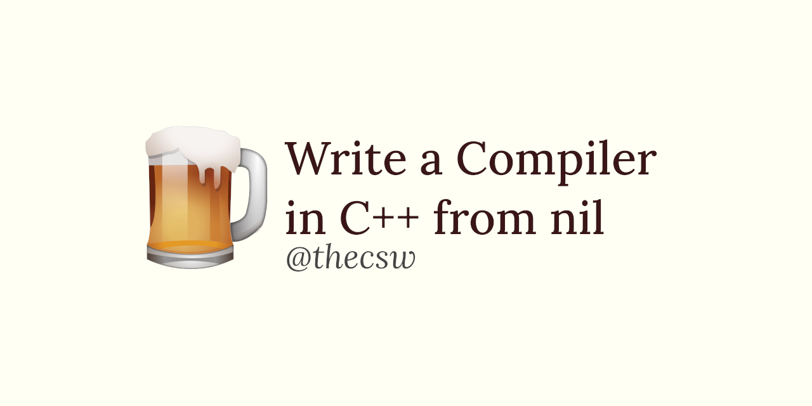

Compiler Written in C++ from Scratch 🍺
======================================

C-rona is a general-purpose, procedural, imperative, and
statically-typed programming language written in C++. Our final project
contains a fully working compiler for x86_64~ machines, which itself was
a semester long project for EECS 665: Compiler Construction, where we
learned the art of building compilers from scratch and this is the
result.

EECS 665: Compiler Construction was taught by the fantastic [Drew
Davidson](https://ittc.ku.edu/_drew/), who made probably one of the
classicaly toughest courses in undergraduate career into one of the most
enjoyable classes I have ever taken in my Computer Science undergrad. I
must boast a little bit here and confess that this might objectively be
the best engineering course at my university and probably the best
compilers course work globally.

I worked on the project with [Zachary
Atkins](https://github.com/zatkins-dev) and without him I wouldn\'t have
gotten anywhere. We were great partners throughout the whole semester.

-\> [Go to the compiler\'s source code](https://github.com/thecsw/crona)
