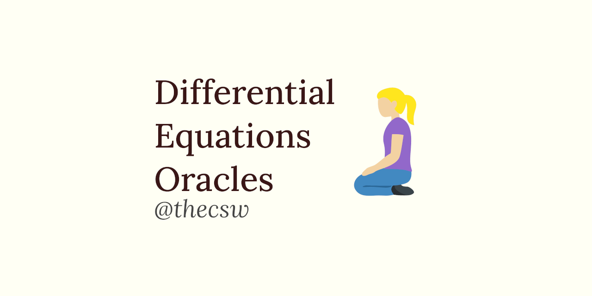

Differential equations oracles 🧎‍♀️
===================================

I also worked as a grader for Ordinary Differential Equations course
(MATH 220), taught by Professor Van Vleck from the department of
Mathematics at University of Kansas. Interestingly enough, one of my
responsibilities was also typing up all the weekly homework solutions so
that they can be used as \"oracles\", i.e. \"source of truth\" when
grading students\' submissions.

This was quite an experience, because it has been a while since my intro
ODE class. In a way, it felt like taking another courseload, as I had to
type everything in LaTeX. Solutions are available both in the web form
(rendered by [MathJax](https://www.mathjax.org)) and in PDF form
(rendered with [LaTeX](https://www.latex-project.org)). This might be a
good source to catch up on your ODEs!

-\> [Go to the ODE Oracles page](https://sandyuraz.com/math220_sp21)
