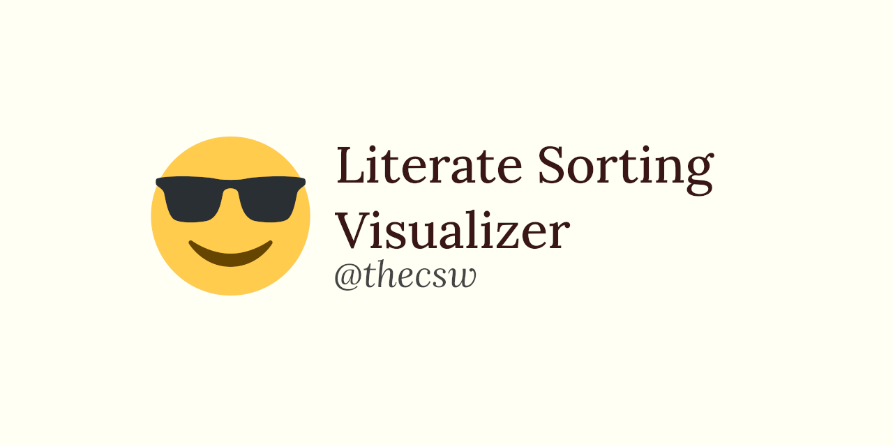

Literate Programming with a Sorting Visualizer 😎
================================================

I must disclose that I have been infected by the dream that [Donald E.
Knuth](https://www-cs-faculty.stanford.edu/_knuth/) wanted to give us
with the [Literate Programming](http://www.literateprogramming.com)
paradigm. Many decades have passed since his original papers and the
[book](https://www-cs-faculty.stanford.edu/_knuth/lp.html) that archives
all of those papers into a nice piece of literature.

I would say that for me, Literate Programming is the way that we should
think about writing software and code. Such that we ought to address our
programs to people and not to machines. Programming itself should be
regarded as a process of writing essays, therefore considered as a
process of creating *works of literature*, which are meant to be read.
(the book above says is better)

Many aspiring computer scientists and programmers have the audacity to
say that one can be a good software developer without knowing how to
write properly or do math rigorously. Both of those claims to me are
quite outrageous. Those are the foundations of our field and what we
are.

Below is a link to a simple terminal-based sorting algorithm visualizer
I wrote in [CWEB](https://www-cs-faculty.stanford.edu/_knuth/cweb.html).
Writing programs and explaining algorithms to people rather than to
computers is actually fun! One can say, it\'s very much enlightening.

-\> [Go to the literate sorting
repository](https://github.com/thecsw/literate-bubble-sort)
