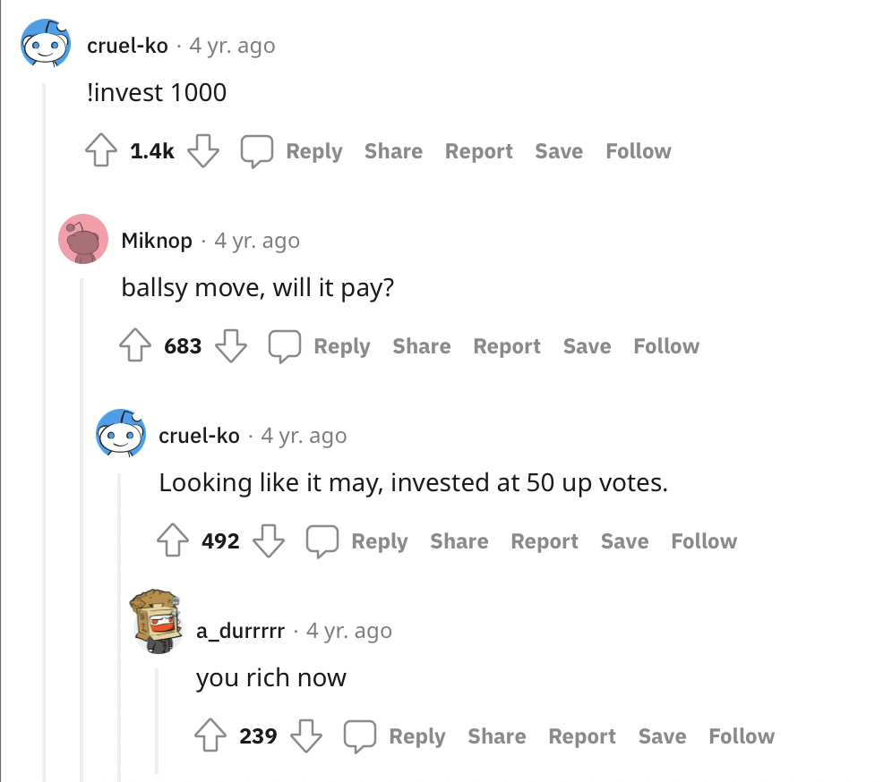

= Become a True Meme Investor 💸
Sagindyk Urazayev <ctu@ku.edu>
About_LINK | Bookshelf_LINK | Fortunes_LINK | Home_LINK
:toc: left
:toc-title: Table of Adventures ⛵
:nofooter:
:experimental:

_Take yourself back to Spring 2018_

I am finally done with my IB exams. These two years were just brutal. I
was longing for a break and now I got it. So… what do I do now? Well, I
found this interesting subreddit
https://reddit.com/r/MemeEconomy[r/MemeEconomy]. People post memes and
joke about investing with profits. So I think to myself, why not make it
real?

I went to see Deadpool 2 with my friends today and my parents have some
guests visiting tonight, so that means I have an evening to do whatever.
I sat down and punched down some python code that catches
`!invest AMOUNT` comments on the subreddit, uses karma difference in
time for a linear profit formula, and stores everything in a single text
file. Sounds good to me!

It all took about an hour or so of code writing, an hour more of
testing/debugging, and a couple of minutes to run it public on my trusty
Raspberry Pi 3. Ah, it's running now. Probably won't be used by more
than… let's say ten people. Let me write down `!create` to create an
account for myself, `!invest 100` for fun, and see the guests.

Huh, my phone is blowing up? Oh. My. God.
https://www.reddit.com/r/MemeEconomy/comments/8lc19o/just_made_this_format_have_i_struck_gold/[It
blew up.] Big time. On the same evening the bot first came live, a
couple of people spotted this interesting reddit bot that recognizes
commands to invest in memes? Let's all create and account and see what's
it's about!! Oh crap. The measely text file corrupted with number of
writes and it of course
https://www.reddit.com/r/MemeEconomy/comments/8lc19o/comment/dzetc6b[crashed]

.MemeInvestor_bot went down
image::create.png[MemeInvestor_bot went down, link="create.png"]

Hey mom, dad, I need to go upstairs real quick. Be right back. Okay. I
remember like a week ago I've heard about this thing called
_S-Q-L-Lite?_ I don't know how to use the big boy databases, but this
one just uses a file. Okay, let me quickly swap the file-based functions
with sqlite-based functions.

_10 minutes later_

Alright, push it live right back up. Let's make meme investments real!
I'm hungry, let me go downstairs and have faith in my coding

https://www.reddit.com/r/MemeEconomy/comments/8lc19o/comment/dzeefkl[Early
investors] saw very good returns

.My man, I have invested 300 in this meme, don’t let me down
image::300.png[My man, I have invested 300 in this meme, don’t let me down, link="300.png"]

https://www.reddit.com/r/MemeEconomy/comments/8lc19o/comment/dzecssj[Some
people] even liked the new feature!

.I finally understand this subreddit
image::invest.png[I finally understand this subreddit, link="invest.png"]

https://www.reddit.com/r/MemeEconomy/comments/8lc19o/comment/dzeeev4[Some]
even bet their everything

.ballsy move, will it pay?

You might wonder, how did the bot work back then? Here is the
https://www.reddit.com/r/MemeEconomy/comments/8lc19o/comment/dzet1ec[help
message] and available commands at the time

.!help
image::help.png[!help, link="help.png"]

And here are the
https://www.reddit.com/r/MemeEconomy/comments/8lc19o/comment/dzed7e6[messages]
with investment updates

.!invest
image::update.png[!invest, link="update.png"]

And 15 thousand more messages that are just `!create`, `!invest`, and
`!balance`. Dinner was good and I'm happy with how this little meme
investor turned out. I wonder how I can work on it more?

_So what about today?_

Well, this whole project turned out to be more than I thought it would
be.
