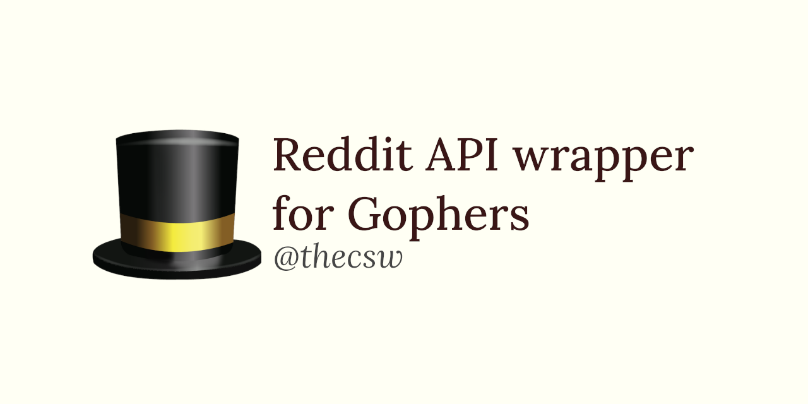

Reddit API wrapper for gophers 🎩
================================

I like Go and I think it\'s a great language. I built
[memeinvestor_bot_](https://github.com/thecsw/memeinvestor_bot), which
was one of the interactive reddit bots on the platform at the time. So
you can imagine we used quite a bit of
[praw](https://github.com/praw-dev/praw). About year and a half later,
the python codebase became so disgusting and unmaintainable, where I
decided to re-write the whole thing in Go. (The old \"let\'s rewrite
everything\" syndrome\") Re-write would be too strong, re-build from
scratch is what the goal was.

Surely, after a couple of seconds of DuckDuckGoing, I stumbled upon
[graw](https://github.com/turnage/graw), one of the most popular Go
Reddit Api Wrappers. I remember that I was just learning Go at a time
and really just wanted to do something with it. Graw\'s deal with
`announcer` and other stuff confused me a bit. So I did what every
software engineer does when it itches the wrong way. Make a new library!

I present to you, [mira](https://github.com/thecsw/mira)! It\'s a really
playful and straight-forward library. Mira aggressively uses the
dot-notation ([gorm](https://github.com/jinzhu/gorm) style) and has the
simplicity of praw. Golang\'s great features as goroutines are used to
implement the streaming functionality.

-\> [Go to the mira article](https://sandyuraz.com/blog/mira_reddit)

-\> [Go to mira\'s repository](https://github.com/thecsw/mira)
