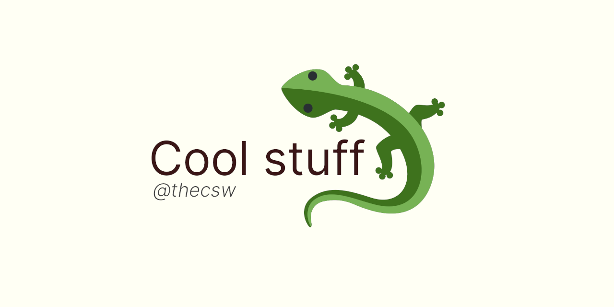

Cool stuff 🦎
============

Some of the cool things I\'ve done over the years, such as projects,
websites, papers, etc! Hope you find something interesting for yourself

Literate Programming with a Sorting Visualizer 😎
------------------------------------------------

I must disclose that I have been infected by the dream that [Donald E.
Knuth](https://www-cs-faculty.stanford.edu/_knuth/) wanted to give us
with the [Literate Programming](http://www.literateprogramming.com)
paradigm. Many decades have passed since his original papers and the
[book](https://www-cs-faculty.stanford.edu/_knuth/lp.html) that archives
all of those papers into a nice piece of literature.

I would say that for me, Literate Programming is the way that we should
think about writing software and code. Such that we ought to address our
programs to people and not to machines. Programming itself should be
regarded as a process of writing essays, therefore considered as a
process of creating *works of literature*, which are meant to be read.
(the book above says is better)

Many aspiring computer scientists and programmers have the audacity to
say that one can be a good software developer without knowing how to
write properly or do math rigorously. Both of those claims to me are
quite outrageous. Those are the foundations of our field and what we
are.

Below is a link to a simple terminal-based sorting algorithm visualizer
I wrote in [CWEB](https://www-cs-faculty.stanford.edu/_knuth/cweb.html).
Writing programs and explaining algorithms to people rather than to
computers is actually fun! One can say, it\'s very much enlightening.

-\> [Go to the literate sorting
repository](https://github.com/thecsw/literate-bubble-sort)

Счастье маленького человека 🧥
-----------------------------

In the Spring of 2021, I took one of the best courses ever! This was
RUSS 712, a graduate class in Russian Literature. We read all the
beautiful short stories by such masters like Pushkin (Blizzard), Gogol
(The Overcoat) Tolstoy (Blizzard), Chekhov (The Lady with the Dog),
Dostoevsky (The Dream of a Ridiculous Man), and dozens more. We would
progress ourselves into modern times, so starting from 19th century and
ending up somewhere in 2010s.

As a final project for the course, we had to make a 15-minute recorded
video of us talking in TED-talk style about a research topic of our
choice. My choice was called Счастье маленького человека (Little Man\'s
Happiness), where I contemplated about what does it mean for a fallen
man to be happy, basing on works of Gogol, \"The Overcoat\", and
Dostoevsky, \"The Dream of a Ridiculous Man\". The video itself is in
Russian. Sorry, I just couldn\'t bring myself to record an English
version after doing close to 50 full takes of my talk.

At least you get to see a moving picture of me! Haha

-\> [Go to the recorded presentation](https://youtu.be/dtVUzEh7Ddo)

A Simplified Smart Home Model 🏠
-------------------------------

In the Spring of 2021, I was taking [Professor
Li](http://www.ittc.ku.edu/_fli/)\'s EECS 700: IoT Security, which was a
fantastic course over some basic and more advanced aspects of Internet
of Things and their security considerations. We had a semester-long
final project for the class. My beautiful partner, Anissa Khan and I
built and documented a securite model of a smart home. Below is the
abstract from our paper and related links.

**Abstract --** The Internet of Things (IoT) has become more prevalent
in our everyday lives through the use of smart home devices. As such,
the security of smart home systems has become of paramount importance.
In this study, we design and implement a simplified smart home model
that is meant to serve as a testbed for a wide range of smart home
systems. Once implemented we perform a security analysis of the whole
system and put security controls in place. In doing so, we demonstrate
ways in which the general IoT smart home system can be secured.

-\> [Go to the project\'s final
paper](https://github.com/thecsw/sandissa-dev/blob/master/sandissa.pdf)

Compiler Written in C++ from Scratch 🍺
--------------------------------------

C-rona is a general-purpose, procedural, imperative, and
statically-typed programming language written in C++. Our final project
contains a fully working compiler for x86_64~ machines, which itself was
a semester long project for EECS 665: Compiler Construction, where we
learned the art of building compilers from scratch and this is the
result.

EECS 665: Compiler Construction was taught by the fantastic [Drew
Davidson](https://ittc.ku.edu/_drew/), who made probably one of the
classicaly toughest courses in undergraduate career into one of the most
enjoyable classes I have ever taken in my Computer Science undergrad. I
must boast a little bit here and confess that this might objectively be
the best engineering course at my university and probably the best
compilers course work globally.

I worked on the project with [Zachary
Atkins](https://github.com/zatkins-dev) and without him I wouldn\'t have
gotten anywhere. We were great partners throughout the whole semester.

-\> [Go to the compiler\'s source code](https://github.com/thecsw/crona)

Data Structures from EECS 560 🏛
-------------------------------

EECS 560: Data Structures taught by [Dr. Suzanne M.
Shontz](https://people.eecs.ku.edu/_s906s230/) has been a fun class! A
lot of reading and on-paper-algorithm-analysis and dry running. The
course itself was also accompanied by a series of labs, where we would
implement various data structures that we learned in class. Such a list
includes but not limited to: Binary Search Trees, Priority Queues
(Leftist trees, min heaps, max heaps, min-max heaps), Linked Lists, Hash
Tables (various sorts of addressing and hash conflict resolution
functions), etc.

I took the code I wrote for some of those labs and published them in a
separate repo. Maybe it can serve as a good source to look up some
simple data structures. Do not copy or plagiarize the work for your own
labs. Some quick documentation follows in the repository itself.

-\> [Go to EECS 560 data structures
repository](https://github.com/thecsw/algo560)

Sandy\'s Tutor Notes for Spring 2021 📝
--------------------------------------

During Spring 2021 semester, I worked as a tutor for the School of
Engineering. As one of the tutors, we held multiple a series of study
sessions every week, on subjects and classes ranging from Calculus
I/II/III to Phyics I/II and Chemistry I/II.

I took digital notes on my tablet during every meeting and they have
just been fully documented on a separate webpage. I taught Calculus II,
Calculus III, and Physics I. It was a lot of fun!

If you are a student and struggling with some of the courses above, you
can look at the notes as a bank of problems with detailed solutions. As
a tutor or a grader or a teaching assistant, you would be able to find a
good source of teaching material and the curriculum of those courses.

-\> [Go to the study session notes](https://sandyuraz.com/tutor_sp21/)

Ordinary Differential Equations Oracles 🧎‍♀️
--------------------------------------------

I also worked as a grader for Ordinary Differential Equations course
(MATH 220), taught by Professor Van Vleck from the department of
Mathematics at University of Kansas. Interestingly enough, one of my
responsibilities was also typing up all the weekly homework solutions so
that they can be used as \"oracles\", i.e. \"source of truth\" when
grading students\' submissions.

This was quite an experience, because it has been a while since my intro
ODE class. In a way, it felt like taking another courseload, as I had to
type everything in LaTeX. Solutions are available both in the web form
(rendered by [MathJax](https://www.mathjax.org)) and in PDF form
(rendered with [LaTeX](https://www.latex-project.org)). This might be a
good source to catch up on your ODEs!

-\> [Go to the ODE Oracles page](https://sandyuraz.com/math220_sp21)

Selected Final Projects for Embedded Systems 🚗
----------------------------------------------

In the Fall of 2020 I was enrolled in EECS 388: Embedded Systems. It\'s
an introduction course into lower level things, such as RISC-V, Computer
Architecture, CPU scheduling, and other fun stuff. The course itself was
accompanied by a lab section, where we wrote some C+Assembly to control
UART signals, some lights, etc.

The final project for the class was us building a self-driving car that
uses a pre-trained neural network for recognizing tracks on the ground
that it reads from its camera. The car itself uses Raspberry Pi as a
main board computer, HiFive micro-controller for the wheels connected
via UART to the Pi.

We built up extensions to the final project, I worked with KayLee
Mitchell on building a car that can be controlled from any
browser-capable device via a webpage and some quick interfaces hooked up
onto our little car. It was a fun farewell to this course. The link
below has a webpage written by me by the request of our Instructor to
document some selected final projects.

-\> [Go to the selected finals
webpage](https://sandyuraz.com/eecs388_projects/)

(above is the backup, original should be [available
here](https://eecs388.ku.edu/388Fa2020_selected_final))

Image Compression using Principal Component Analysis 🎱
------------------------------------------------------

MATH 596: Computational Data Science by [Erik S. Van
Vleck](https://erikvv.ku.edu) was quite a trip. The philosophy of the
course was \"sink-or-swim\", which means that you either succeed in the
class and what\'s expected or you just fail it completely. Never have I
ever gone through a more brutal multivariate statistics crash course. I
must admit that I met some wonderful people there that I never would
have had a chance to make an acquaintance with, if it weren\'t for this
class.

Our first small project was applying [Principal Component Analysis
(PCA)](https://en.wikipedia.org/wiki/Principal_component_analysis) to
some old or new problems. I liked the theory and wanted to see how well
I can compress images, therefore extracting the most important
(principal, haha) components of a data set and present an approximation
of it by only using a fraction of the original set. I did in in python,
I recommend running `lenna.py` if you\'re curious to see how it works.

-\> [Go to the PCA image compression code
files](https://git.sr.ht/_thecsw/lenna/tree)

L\'Hôpital\'s Rule 🏥
--------------------

Before I became a tutor at the School of Engineering, as one of the
support materials I made for Calculus II was a quick web presentation on
L\'Hôpital\'s Rule, its importance and the motivation behind it.

-\> [Go to the web presentation](https://sandyuraz.com/present/lhopital)

Cryptography Library for RSA, Lenstra, elliptic curves 🍾
--------------------------------------------------------

In Spring 2020, the COVID semester, I was taking MATH 601: Cryptography
that was at the time taught by [Emily Witt](https://witt.ku.edu).
Probably one of the hardest undergraduate courses I ever had to take!
And definitely the one I enjoyed the most. We basically covered a big
chunk of Group and Ring theory as background material during our first
week. I just learned the material for my separate Group Theory class
from Professor Witt in a week. Fun!

Essential part of the course was us writing code to run some basic
algorithms (greatest common divisor, extended euclidean algorithm,
chinese remainder theorem) and not-so-basic (William\'s p+1 algorithm,
Pollard\'s p-1 algorithm, Lenstra elliptic-curve factorization, etc.).
After we were done with the course during the 2020 pandemic, I decided
to release some code snippets I wrote during the course. The files are
heavily commented but not properly documented (I should probably find
some time for that)

-\> [Go to MATH 601: Cryptography code
files](https://git.sr.ht/_thecsw/crypto/tree)

Sentocks or Sentimental Stocks 💇‍♀️
-----------------------------------

A group of my friends and I created a platform that continuously listens
to tweets mentioning various publicly traded companies and we compare
the general audience\'s sentiment to companies\' stock value! It was a
fun project we did for EECS 448: Software Engineering. The project is
well-documented with some pretty pictures and results that we got.
Answer? Well, after applying some signal processing techniques,
filtering out bad data, matching timesets, we found that there is a very
loose correlation. Sometimes it\'s very good! Sometimes, it\'s the
complete opposite.

-\> [Go to Sentocks\' development
repository](https://github.com/thecsw/sentock)
