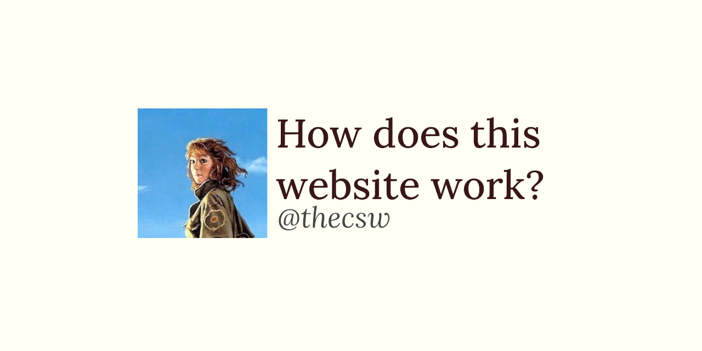

This Website 🌐
==============

I love typesetting tools. In my experience, I have used and written
articles and papers using the following list of tools: `LaTeX`, `groff`,
`markdown`, `Org-Mode`, `asciidoctor`, `HTML`, `plain text`. I had to
decompress Word files and wrestle with raw XML files there, what a trip
that was.

This beautiful website typed in [Org-Mode](https://orgmode.org/) and
built using [Asciidoctor](http://asciidoctor.org). The source code is
[here](https://github.com/thecsw/thecsw.github.io).

It is one of my dreams to typeset documents and books like Brian
Kernighan:

-   [The GO Programming Language](https://www.gopl.io/)
-   [C Programming Language, 2nd
    Edition](https://en.wikipedia.org/wiki/The_C_Programming_Language)
-   [The Unix Programming
    Environment](https://en.wikipedia.org/wiki/The_Unix_Programming_Environment)
